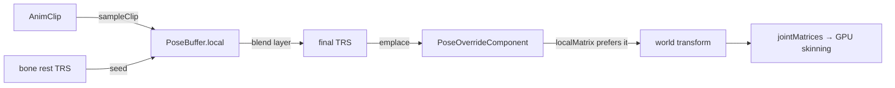

+++
title = 'Playback runtime'
weight = 2
+++

# Playback runtime

The playback runtime is the per-frame step that turns an animation clip into a visible pose. It
reads each rig's `AnimationPlayerComponent`, samples its clip at the current playhead, and writes
the result onto the skeleton — without ever touching the authored rest pose. Like UE5 (Persona)
and Unity (the Animation window), it previews in the editor without entering play: preview is
decoupled from the game's play state.

The authored bone `TransformComponent`s are the rest pose and are never written. The animated
pose lives in a separate runtime-only `PoseOverrideComponent` that world-transform composition
prefers when present. That single rule makes Edit preview non-destructive *by construction* — there
is no snapshot to take or restore, and nothing marks the project dirty.

## The flow

`tickAnimation` runs once per frame over every entity with both an `AnimationPlayerComponent` and a
`SkinnedMeshComponent`:

1. **Gate.** In Play every rig is active; in Edit only a rig whose player has `previewInEdit` set is.
   An inactive rig has its overrides removed, so it falls back to the rest pose.
2. **Advance.** When `playing`, the playhead moves by `dt × speed` under the wrap mode (below).
3. **Sample.** A `PoseBuffer` is seeded with each bone's rest local TRS, then `sampleClip` writes the
   tracked joints over it — so an untracked joint, or an untracked channel of a tracked joint, keeps
   its authored value.
4. **Resolve.** Each track binds to its joint by index when sound, re-resolved by the durable node
   name when the index is stale (the [clip/track model](../animation-data-model/) carries both).
5. **Blend.** `final = weight == 0 ? local : blend(local, override, weight)`. The per-bone blend
   layer is inert in v1 (all weights 0, so `final == local`), but the call site exists so a later
   pose producer — foot IK, a powered ragdoll — only writes `override_` + `weight`.
6. **Write.** The final TRS is emplaced as a `PoseOverrideComponent` on each driven bone.

`updateWorldTransforms` then composes each bone from its override (via its quaternion directly, no
Euler round-trip) instead of its `TransformComponent`, and `jointMatrices` feeds the GPU skinning
pass as before. The runtime needs no change to the skinning math — only the *source* of a bone's
local transform changes.

## Edit preview vs Play

Animation is evaluated every frame in **both** modes, gated internally:

- **Edit** — only a `previewInEdit` rig animates; everything else stays at rest. Importing a rig does
  not auto-play it (matching UE/Unity, which don't auto-run level animation in-editor). The timeline
  (a later phase) sets `previewInEdit` + `playing`/`time` to scrub or play the selected entity.
- **Play** — every rig animates as part of the simulation. Play still uses the duplicate-and-discard
  scene for scripts and spawns; animation simply never needs it, because it never mutates authored
  data. `Stop` discards the play scene and the authored rest pose returns untouched.

`tickAnimation` runs before scripts in the host's `onUpdate`, so during Play the pose lands first
and a script can still override a bone through the same `PoseOverrideComponent` the same frame.

## Wrap modes and speed

`speed` scales `dt` (negative plays backward). `wrap` decides the end behaviour:

- **Once** — clamp at the end (or start) and stop `playing`.
- **Loop** — wrap the playhead modulo the duration.
- **PingPong** — bounce at each end, flipping the stored direction.

## In the code

| What | File | Symbols |
|---|---|---|
| Evaluator (gate, advance, sample, blend, write) | `animation.cpp` | `tickAnimation`, `advanceTime`, `blendJoint` |
| Edit/Play mode + clip cache | `animation.cppm` | `AnimMode`, `AnimationRuntime` |
| Dumb-data player | `scene.cppm` | `AnimationPlayerComponent` |
| Runtime pose override + composition | `scene.cppm` | `PoseOverrideComponent`, `localMatrix`, `updateWorldTransforms` |
| Per-frame host wiring | `host.cppm` | `tickAnimation` call in `onUpdate` |

> [!NOTE]
> The clip cache is keyed by clip Uuid and cleared on project (re)load. Because every import mints a
> fresh Uuid, a cache entry can never return the wrong clip — reload-invalidation is memory hygiene,
> not a correctness requirement.

## Related

- [Animation data model](../animation-data-model/) — the clip/track/pose types this samples and blends
- [Transforms & matrices](../../scene-and-ecs/transform-and-matrices/) — the world composition it feeds
- [Play mode](../../ui-and-editor/play-mode/) — the duplicate-and-discard scene Play uses elsewhere
