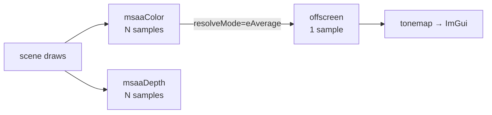

+++
title = 'MSAA'
weight = 1
+++

# MSAA

Multisample anti-aliasing cleans geometry edges by rasterizing the scene at several samples
per pixel and resolving them down to one. It is the only mode here that works at
rasterization time rather than as a post-process, so it fixes what FXAA and TAA can only blur
over: hard polygon edges against the background. The flip side is that it sees nothing inside
a triangle.

## How it works

When MSAA is on, the scene no longer renders straight into the offscreen. The renderer
allocates a multisampled color/depth pair (`msaaColor`, `msaaDepth`) at the requested sample
count and the offscreen's extent, and points the scene pass at those. At end-of-pass the
multisampled color is resolved into the single-sample offscreen, which is what ImGui samples
and what tonemap reads.

The scene pass declares the resolve as part of its color attachment. The multisampled image
is the attachment, the offscreen is its `resolve` target, and the multisampled samples are
discarded after the resolve (`eDontCare`) since only the resolved image is kept.

### Resolve in the graph

The [render graph](../../frame-and-render-graph/render-graph-overview/) treats an
`RgAttachment.resolve` as a second color write. It runs `applyAccess` against the resolve
target with `ColorWrite` usage, so the barrier and layout for the offscreen come out the same
way as any other attachment. When it builds the dynamic-rendering attachment info it sets
`resolveMode = eAverage`, which averages each pixel's N samples into one. The pass body never
changes: the same draw list records into a multisampled attachment, and the hardware resolves
at `endRendering`.

### Sample count baked into PSOs

A graphics pipeline declares how many samples it rasterizes against, and that has to match the
attachment. The mesh and depth-prepass PSOs read `renderer.targets.sampleCount` when they are
built. Because the count is baked in, changing the MSAA level can't just swap a target — every
mesh PSO is now stale. `setAa` clears the PSO cache so übershader pipelines rebuild on demand
at the new count, and rebuilds the depth-prepass pipeline immediately.

## In the code

| What | File | Symbols |
|---|---|---|
| Mode switch + clamp + PSO rebuild | `renderer_aa.cpp` | `setAa`, `maxSampleCount` |
| Multisampled target pair | `renderer_detail.cppm` | `recreateMsaaTargets`, `msaaColor`, `msaaDepth` |
| Sample count in PSO | `renderer_pipelines.cpp` | `rasterizationSamples` |
| Scene attachment + resolve wiring | `renderer.cppm` | `beginFrameGraph` · `sceneColorAtt.resolve` |
| Resolve in the graph | `render_graph.cppm` | `RgAttachment.resolve`, `resolveMode = eAverage` |

> [!NOTE]
> Depth is multisampled too (geometry has to test against the right per-sample coverage) but
> is never resolved — it is `eDontCare`. Only the resolved offscreen color survives the pass.

## Related

- [AA modes](../aa-modes/) — the full mode table and how the three are switched
- [FXAA](../fxaa/) — the cheap post-process alternative
- [TAA](../../screen-space-and-post/taa/) — the temporal alternative
- [Render graph](../../frame-and-render-graph/render-graph-overview/) — derives the resolve
