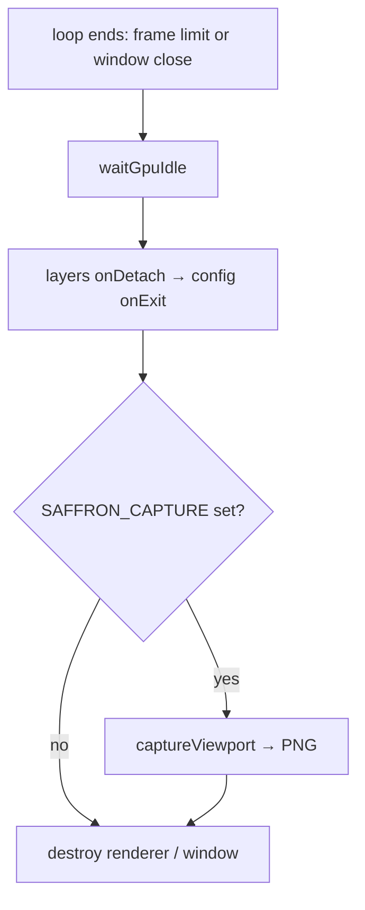

+++
title = 'Headless runs'
weight = 5
+++

# Headless runs

A headless run is an instance of the loop that terminates on its own and records its output
without a person at the window. Two environment variables drive it: one bounds the run to a
fixed number of frames, the other writes the final viewport image to a PNG.

A normal run continues until the window closes, which automated verification cannot wait for.
The two variables together let a script start the engine, render a known number of frames,
exit, and diff the result against a reference image.

## Exit after N frames

`SAFFRON_EXIT_AFTER_FRAMES=N` makes the loop count its iterations and stop after `N`. The
value is parsed once at startup, and the whole-string check rejects trailing junk like `5x`:
a typo is logged and ignored rather than parsed as its leading digits. A limit of 0 (unset
or malformed) means run forever.

```cpp
auto frameLimitFromEnv() -> u64
{
    const char* raw = std::getenv("SAFFRON_EXIT_AFTER_FRAMES");
    if (raw == nullptr) { return 0; }
    std::string_view text{ raw };
    u64 parsed = 0;
    auto result = std::from_chars(text.data(), text.data() + text.size(), parsed);
    if (result.ec != std::errc{} || result.ptr != text.data() + text.size())
    {
        logError(std::format("invalid SAFFRON_EXIT_AFTER_FRAMES='{}', ignoring", text));
        return 0;
    }
    return parsed;
}
```

When `frameCount` reaches the limit, `run` sets `app.running = false` and exits through the
normal teardown path: the same `waitGpuIdle` → `onDetach` → `onExit` ordering as a manual
close. A frame counts whether or not it rendered, so a minimized window still advances the
count.

## Capture the viewport

`SAFFRON_CAPTURE=path` writes the offscreen viewport image to a file after the loop ends,
during teardown. `captureViewport` reads the last rendered offscreen back to the host and
encodes it as a PNG in four steps:

1. `device.waitIdle()` — the offscreen may still be sampled by an in-flight frame, so idle
   first or the capture's layout transition races that read.
2. Allocate a host-visible buffer sized `width × height × formatPixelBytes(format)`.
3. Record a one-time command buffer that transitions the image, copies it to the buffer, and
   transitions it **back to `ShaderReadOnly`** — leaving the image in the layout the next
   frame's producer barrier expects, so capture does not desync the cross-frame layout.
4. Submit, `waitIdle` again, invalidate the mapping, and write the PNG.

The offscreen is `rgba16f` HDR. `writeBufferToPng` unpacks the half-floats and clamps each
channel to `[0, 1]`, so the PNG holds the tonemapped display image, not the raw HDR values.
On failure `run` logs the error and exits normally.



The control plane has its own live `se screenshot` command for grabbing the viewport or
window while the editor runs. `SAFFRON_CAPTURE` is the no-socket path: a single end-of-run
write driven entirely by the environment, used by the headless pixel checks.

## In the code

| What | File | Symbols |
|---|---|---|
| Frame-limit parse | `app.cppm` | `detail::frameLimitFromEnv` |
| Counting + exit | `app.cppm` | `run` — `frameCount`, `frameLimit` |
| Capture trigger | `app.cppm` | `run` — `SAFFRON_CAPTURE` block |
| Readback + PNG | `renderer_capture.cpp` | `captureViewport`, `writeBufferToPng`, `formatPixelBytes` |
| Live screenshot | `renderer_capture.cpp` | `requestWindowCapture`, `captureSupported` |

> [!TIP]
> `captureViewport` calls `device.waitIdle()` itself, so it is safe to invoke during teardown
> after the loop has stopped. It captures the *offscreen* (the viewport contents), not the
> swapchain, so the PNG is the scene exactly as the viewport panel showed it.

## Related

- [Main loop](../main-loop-and-run/) — where both env vars are read and applied
- [Tonemapping and exposure](../../screen-space-and-post/tonemap-and-exposure/) — why the PNG is the tonemapped display image
