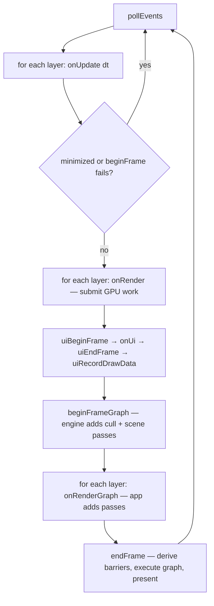

+++
title = 'Main loop'
weight = 1
+++

# Main loop

A SaffronEngine program is a config and a call. You don't subclass an application or override
a virtual `update`. You fill an `AppConfig`, hand it to `se::run`, and let `run` own the
window, renderer, UI, and the loop while it calls your layers.

```cpp
struct AppConfig
{
    WindowConfig window;
    std::function<void(App&)> onCreate;  // runs once, after window + renderer + ui exist
    std::function<void(App&)> onExit;    // runs during teardown
};

auto run(AppConfig config) -> int;       // returns a process exit code
```

## Startup

`run` builds the three subsystems in order and checks each one with the
[error-handling](../../core-and-conventions/error-handling/) pattern: `newWindow`, then
`newRenderer`, then `newUi`. If one fails, `run` tears down whatever already exists and
returns 1.

Then `onCreate` runs. That is where the client attaches its layers and wires window signals.
Every layer's `onAttach` fires next, and `onClose` is subscribed right after window creation
so closing the window flips `app.running` to false.

## One iteration

The loop body is the contract every feature plugs into, and the order matters. Input comes
first, then logic, then the GPU frame. Inside the frame the UI is recorded before the graph
is built, so ImGui's draw data is ready when the frame executes.



`beginFrame` returns false when the swapchain can't be acquired (a resize or a minimized
window), and the loop skips rendering that iteration instead of erroring. `delta` is a real
wall-clock `TimeSpan` from `steady_clock`, passed to every `onUpdate`.

The two render seams are deliberately different. `onRender` is the immediate
[submit seam](../the-submit-and-rendergraph-seams/): record commands into the current frame.
`onRenderGraph` hands the layer the live frame graph so it can *add passes* — that is how an
app-authored post-process step slots in between the scene and the present. The engine's cull
and scene passes are already in the graph by the time layers see it.

## Shutdown order

When the loop ends, `run` calls `waitGpuIdle` **before** anything is torn down. This is the
whole resource-lifetime contract: `onDetach` and `onExit` are where the client drops its
resource `Ref`s, and those resources must not be freed while a command buffer still
references them. Idling the GPU first guarantees nothing in flight outlives the allocator.
Get the order backwards and you free a buffer the GPU is mid-read on.

```cpp
waitGpuIdle(app.renderer);          // finish all in-flight GPU work first
for (Layer& layer : app.layers) if (layer.onDetach) layer.onDetach();
if (config.onExit) config.onExit(app);
// optional SAFFRON_CAPTURE dump here
destroyUi(...); destroyRenderer(...); destroyWindow(...);
```

## Headless runs

Two environment variables make `run` scriptable for verification. `SAFFRON_EXIT_AFTER_FRAMES=N`
counts frames and exits cleanly after `N` (parsed strictly; a malformed value logs and is
ignored). `SAFFRON_CAPTURE=path` dumps the offscreen viewport image to a file after the loop.
See [headless runs and capture](../headless-and-capture/).

## In the code

| What | File | Symbols |
|---|---|---|
| Config + types | `app.cppm` | `AppConfig`, `App`, `Layer`, `attachLayer` |
| The loop | `app.cppm` | `run` |
| Frame seam | `renderer.cppm` | `beginFrame`, `submit`, `beginFrameGraph`, `frameGraph`, `endFrame` |
| Headless | `app.cppm` | `detail::frameLimitFromEnv`, `captureViewport` |

## Related

- [Layers as a struct of closures](../layer-system/)
- [Render seams](../the-submit-and-rendergraph-seams/)
- [Render graph](../../frame-and-render-graph/render-graph-overview/) — what `beginFrameGraph`/`endFrame` drive
