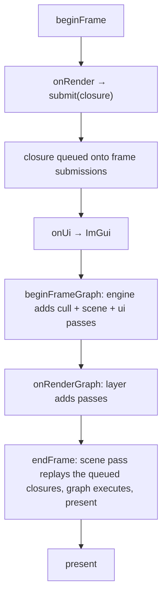

+++
title = 'Render seams'
weight = 3
+++

# Render seams

A layer has two ways to put work on the GPU, and they are not interchangeable. The dividing
line is whether you are *drawing into* the world or *inserting a stage* of your own. `onRender`
records commands into a pass the engine already opened; `onRenderGraph` adds new passes to the
frame graph between the engine's stages and the present. Pick by intent: a mesh, debug line,
or gizmo goes through `onRender`; a full-screen effect, extra render target, or compute step
with its own synchronization is a pass of its own.

## Submit seam: recording into the frame

`onRender` runs inside the frame, after `beginFrame`. From it a layer calls `submit`, which
queues a closure onto the current frame's submission list:

```cpp
void submit(Renderer& renderer, RenderFn fn)
{
    renderer.frame.sceneSubmissions.push_back(std::move(fn));
}
```

The closure takes the frame's command buffer and is replayed later, when the graph executes
the scene pass. This is the backend-agnostic seam carried over from the old engine: there a
submitted lambda received a D3D11 context, here it receives a `vk::CommandBuffer`. The layer
never opens a rendering scope or manages a barrier — it records draw calls into a scope the
graph owns. `submitUi` is the same idea for the UI pass; the ImGui backend uses it to record
its draw data into the swapchain pass.

## Render-graph seam: adding passes

`onRenderGraph` is handed the live `RenderGraph` after the engine has already added its own
passes for the frame:

```cpp
beginFrameGraph(app.renderer);                 // engine adds cull + scene + ui passes
for (Layer& layer : app.layers)
{
    if (layer.onRenderGraph) { layer.onRenderGraph(frameGraph(app.renderer)); }
}
endFrame(app.renderer);                         // derive barriers, execute, present
```

A layer adds a pass by declaring what it reads and writes and supplying the body. The graph
derives the barriers and layout transitions from those declarations — the layer writes none.
That is how an app-authored post-process slots in: it declares the offscreen as a
read-modify-write storage image, the graph inserts the layout moves around it, and it runs
between the scene pass and ImGui's sample. The demonstrator tonemap layer is exactly this. See
[the render graph](../../frame-and-render-graph/render-graph-overview/) for how a pass is
declared and how the barriers fall out.

## Two seams, one frame



## In the code

| What | File | Symbols |
|---|---|---|
| The two layer hooks | `app.cppm` | `Layer::onRender`, `Layer::onRenderGraph`, `run` |
| Submit seam | `renderer.cppm` | `submit`, `submitUi`, `frame.sceneSubmissions` |
| Graph access | `renderer.cppm` | `beginFrameGraph`, `frameGraph`, `endFrame` |
| Pass declaration | `render_graph.cppm` | `RgPass`, `addPass`, `RgUsage` |

> [!TIP]
> A closure submitted from `onRender` does not run when you call `submit`. It is queued and
> replayed when the graph executes the scene pass in `endFrame`. So capture by value (or keep
> the data alive); anything you reference by pointer must still be valid at the end of the
> frame, not just at submit time.

## Related

- [Layers as a struct of closures](../layer-system/) — where `onRender`/`onRenderGraph` come from
- [Main loop](../main-loop-and-run/) — the order the seams fire in
- [Render graph](../../frame-and-render-graph/render-graph-overview/) — what `onRenderGraph` adds passes to
