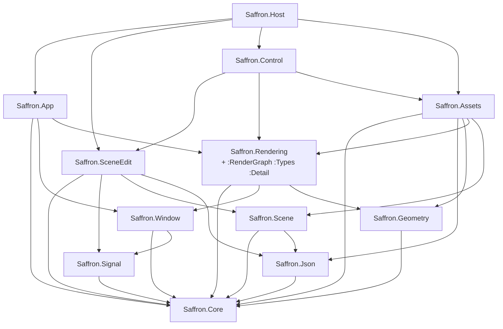

+++
title = 'Module DAG'
weight = 4
+++

# Module DAG

A module DAG is a dependency structure in which each module imports only the modules below it, and no
import path forms a cycle. The acyclic constraint is what makes the structure a DAG rather than an
arbitrary graph.

The shape carries information. The position of a module fixes where a piece of code belongs and what
it may reach, and it explains why some glue must live in a module of its own.

## The graph

Each area imports only what it needs. `Core` is the root (aliases, `Result`, logging); everything
depends on it directly or transitively. Read top to bottom:



`Saffron.Rendering` is itself split (see [module partitions](../module-partitions/)): the primary
re-exports the `:RenderGraph` and `:Types` partitions, so a consumer importing `Saffron.Rendering`
gets the render-graph and renderer types in one import.

## Why Host is its own module

The host application glue — the `Layer` callbacks, thumbnail cache, import routing, the
`onCreate`/`onExit` closures — calls into `App`, `SceneEdit`, `Control`, `Assets`, and the rest at
once. It cannot live in `Saffron.SceneEdit`. `Control` already imports `SceneEdit`
(`Control → SceneEdit`), so glue inside `SceneEdit` reaching back into `Control` would form a cycle. It
sits in a separate module above everything instead:

```cpp
export module Saffron.Host;

import Saffron.App;
import Saffron.SceneEdit;
import Saffron.Control;
import Saffron.Assets;
// ...
export auto runHost(const char* title, int w, int h) -> int;
```

That keeps the graph acyclic. The host executable's `main.cpp` is then a six-line stub that
imports `Saffron.Host` and calls `runHost`.

> [!NOTE]
> `Saffron.Host` exists only because `Control → SceneEdit` already holds. The host glue
> needs both, so it lives in a module above both rather than inside `SceneEdit`, which would cycle.

## In the code

| What | File | Symbols |
|---|---|---|
| Module list + order | `engine/CMakeLists.txt` | `FILE_SET CXX_MODULES FILES` |
| Root module | `core.cppm` | `export module Saffron.Core;` |
| Re-exported partitions | `renderer.cppm` | `export import :RenderGraph;`, `export import :Types;` |
| Top-of-graph glue | `host.cppm` | `export module Saffron.Host;`, `runHost` |
| Thin entry point | `engine/source/main.cpp` | `import Saffron.Host;`, `se::runHost` |

## Related
- [Module partitions](../module-partitions/) — how `Saffron.Rendering` is split internally
- [C++26 modules](../cxx26-modules/) — the module mechanism itself
- [Main loop](../../app-lifecycle-and-window/main-loop-and-run/) — what `Saffron.App` exposes to `EditorApp`
