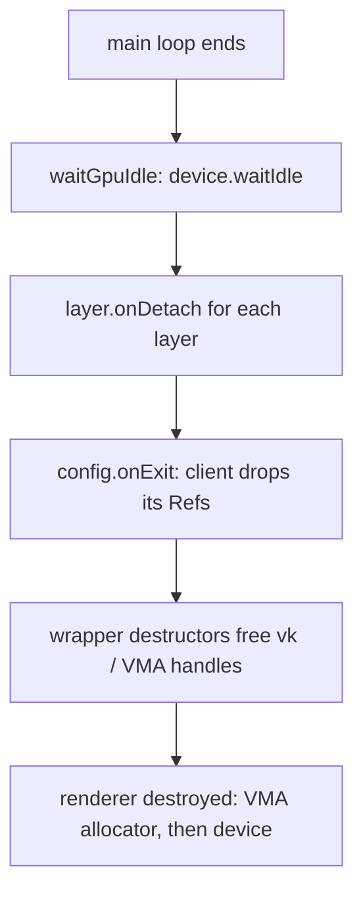

+++
title = 'Ownership'
weight = 4
+++

# Ownership

The renderer has no opaque handles and no GPU resource base class. A Vulkan resource is a
small struct that owns its handles, frees them in its destructor, and is shared as a
`Ref<T>`. The whole scheme rests on one alias in `Saffron.Core` and one ordering rule at
shutdown.

## Ref is a shared_ptr

```cpp
template <typename T>
using Ref = std::shared_ptr<T>;
```

A logical resource — a pipeline, a mesh, a texture — is passed around as `Ref<T>` rather
than an integer handle into some manager. There is no base class and no registry
indirection: the `Ref` is the ownership. The last `Ref` to drop runs the destructor, which
is where the Vulkan handle gets freed.

## Wrappers own and free their handles

Each resource type is a move-only struct holding a borrowed `vk::Device` (and a borrowed
`VmaAllocator` where it allocates), the owned handles, and a destructor that frees them.
`Pipeline` is the simplest:

```cpp
struct Pipeline
{
    vk::Device device;  // borrowed
    vk::Pipeline pipeline;
    vk::PipelineLayout layout;

    Pipeline(const Pipeline&) = delete;
    Pipeline(Pipeline&& other) noexcept;
    ~Pipeline() { reset(); }

    void reset();  // destroys pipeline + layout if device is set
};
```

Copy is deleted; move steals the handles and nulls the source, so a moved-from object's
destructor is a no-op. `reset()` checks `device` is non-null before destroying, so a
default-constructed or moved-from wrapper frees nothing. `Image`, `Buffer`, `GpuMesh`,
`GpuTexture`, `Image3D`, and `AccelerationStructure` all follow this pattern. The
move-only-ness is the one place the codebase writes operator overloads, and the
[conventions](../go-flavored-design/) call it out: this is resource management, not the
operator overloading the style otherwise bans.

## Factories return a Result of a Ref

You don't construct these directly. A factory builds the resource, and because that can
fail, it returns `Result<Ref<T>>`:

```cpp
auto uploadMesh(Renderer& renderer, const Mesh& mesh) -> Result<Ref<GpuMesh>>;
auto newMeshPipeline(Renderer& renderer, std::string_view shaderName, bool unlit)
    -> Result<Ref<Pipeline>>;
```

So the [error model](../error-handling/) and the ownership model meet at the call site:
you check the `Result`, then you hold a `Ref`. The renderer keeps its own `Ref`s in caches
and vectors; a layer or the asset server holds others. The resource lives until every one
of them drops.

## Teardown rule

A GPU resource cannot be freed while an in-flight command buffer still references it, and
it must not outlive the VMA allocator or the device. Those two constraints define the
shutdown order, and `run` enforces it. `waitGpuIdle` blocks on `device.waitIdle()` first,
then the layers detach and `onExit` runs — which is where the client drops the `Ref`s it
held. Those destructors are now safe because the GPU is idle. The renderer (allocator and
device inside it) is destroyed last, after every resource it could have outlived is gone.



## In the code

| What | File | Symbols |
|---|---|---|
| The alias | `core.cppm` | `Ref` |
| Move-only wrappers | `renderer_types.cppm` | `Pipeline`, `Image`, `Buffer`, `GpuMesh`, `GpuTexture` |
| Fallible factories | `renderer_types.cppm` | `uploadMesh`, `uploadTexture`, `newMeshPipeline` |
| The idle barrier | `renderer.cppm` | `waitGpuIdle` |
| The teardown order | `app.cppm` | `run` — `waitGpuIdle` before `onDetach`/`onExit` |

> [!NOTE]
> A `Ref` you stash outside the engine (a layer field, a closure capture) keeps the
> resource alive. If you don't release it in `onDetach`/`onExit`, it can outlive the
> device. Drop client-held `Ref`s at shutdown; `run` already did the `waitGpuIdle` for you.

## Related

- [Go-flavored design](../go-flavored-design/) — why move-only wrappers are allowed operator overloads
- [Error handling](../error-handling/) — factories return `Result<Ref<T>>`
- [Type aliases](../type-aliases-and-primitives/) — `Ref` lives alongside the number aliases
