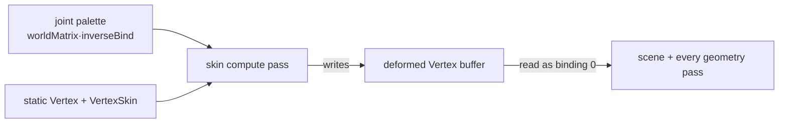

+++
title = 'Compute skinning'
weight = 9
+++

# Compute skinning

A skinned mesh deforms its vertices by a per-joint matrix palette. The naive place to do that is the
graphics vertex shader — and that is where the engine started: a `vertexMainSkinned` variant read the
joint palette and blended four bone matrices per vertex. The cost of that choice is hidden: skinning
in the vertex shader means **every geometry pass needs a skinned pipeline permutation** (depth
pre-pass, each shadow map, the SSAO G-buffer, motion vectors, …), and a ray-traced BLAS built from
the static bind pose never sees the animated shape at all. The engine sidestepped that by simply
*skipping* skinned meshes in those passes — so animated characters cast no shadows, took no AO,
ghosted under TAA, and didn't deform in any ray-traced effect.

Compute skinning deforms **once, up front**, into a buffer laid out exactly like a static mesh. Every
later pass then reads that buffer as ordinary geometry — no skinned permutation, no special case. It
collapses 5+ skinned pipeline variants to zero and is the foundation every later pass (and the BLAS)
builds on.

## The flow

`skin.slang` runs one thread per vertex: it reads the static `Vertex` (position/normal/uv) and the
`VertexSkin` (four joint indices + weights), builds `skinMatrix = Σ wᵢ·palette[jointOffset + jointᵢ]`,
and writes a deformed `Vertex` — the skin matrix applied to the bind pose, **without** the instance
model matrix. The graphics passes still apply `model` / `normalMatrix`, exactly as for a static mesh,
so the result is identical to the old vertex-shader path.

## The deformed buffer

The deformed vertices live in a per-frame, grow-only device buffer (`Skinning.deformedBuffers`),
carrying both `STORAGE` (compute writes it) and `VERTEX` (the scene pass binds it) usage. It is sized
to the sum of skinned-instance vertex counts; each skinned mesh-instance gets a base offset into it,
mirroring the joint-palette's grow-only allocation. Because each instance carries a distinct pose,
skinned draws are **not instanced** — each is one `drawIndexed` whose `vertexOffset` points at that
instance's region of the deformed buffer.

## The compute dispatch

Per skinned mesh-instance, the draw-list build allocates a descriptor set (from a per-frame pool,
reset wholesale each frame) binding the instance's static vertex stream, its skin stream, the joint
palette, and the deformed buffer. A 16-byte push constant carries `{vertexCount, jointOffset,
deformedOffset}`. The `skin` compute pass — placed right after light-cull, before any pass that reads
the deformed buffer — dispatches `ceil(vertexCount/64)` groups per instance.

## Barriers

The pass declares the deformed buffer as `StorageWriteCompute`; the scene pass declares it as
`VertexInputRead`. The [render graph](usage-and-barrier-derivation/) derives the compute-write →
vertex-fetch barrier from that pair — no hand-written `vkCmdPipelineBarrier`. (The static/skin/palette
reads need none: the mesh streams are uploaded long before, and the palette's host write is visible at
submit, the same guarantee the old vertex shader relied on.)

## In the code

| What | File | Symbols |
|---|---|---|
| Compute kernel | `skin.slang` | `computeMain` |
| State + grow-only buffer | `renderer_types.cppm` | `Skinning`, `SkinDispatch` |
| Dispatch build + per-instance sets | `renderer_drawlist.cpp` | `submitDrawList`, `ensureDeformedCapacity` |
| The compute pass | `renderer.cppm` | the `skin` `RgPass` |
| Scene-pass read | `renderer_drawlist.cpp` | `recordSceneDrawList`, `recordBatchSubmeshes` |
| Compute→vertex barrier | `render_graph.cppm` | `RgUsage::VertexInputRead` |

> [!NOTE]
> This phase rewires only the scene pass; the depth/shadow/AO/motion passes still skip skinned
> batches until they too are pointed at the deformed buffer. The deformed buffer already exists and is
> correct — later phases just read it from more passes (and rebuild the BLAS from it).

## Related

- [Barrier derivation](usage-and-barrier-derivation/) — how the compute→vertex barrier is derived
- [Animation playback](../animation/playback-runtime/) — where the pose (and thus the palette) comes from
- [GPU mesh upload](../geometry-and-assets/gpu-mesh-upload/) — the static `Vertex` / `VertexSkin` streams
