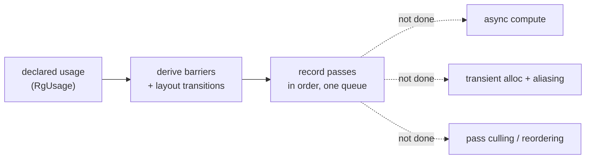

+++
title = 'Limits'
weight = 6
+++

# Limits

The render graph is deliberately small. It does the one job that makes Vulkan tractable — derive
barriers and layout transitions from declared usage — and stops there. Several features a mature
graph eventually grows are missing on purpose, each with the seam already in place so adding it
later is a contained change rather than a rewrite.

## Single graphics queue

Every pass records into one command buffer on one graphics queue, in declaration order.
`executeRenderGraph` walks `graph.passes` start to finish and submits one command buffer. There
is no queue selection on a pass and no second timeline.

That rules out async compute — running a compute pass concurrently on a dedicated compute queue
while the graphics queue does other work. The light-cull and screen-space passes are compute, but
they run inline on the graphics queue, serialized by the same barriers as everything else.

The seam: `RgPass` already carries a `kind` (`Graphics` / `Compute`), and the barrier model is
stage/access based, not queue based. Adding a queue field and a cross-queue semaphore where the
timeline splits is the work; the usage declarations would not change.

## No transient resources, no aliasing

The graph allocates nothing. Every resource is imported — an existing renderer-owned handle
registered with `importImage` / `importBuffer` each frame. There are no graph-created images and
no memory aliasing (reusing one allocation for two resources whose lifetimes don't overlap).

The cost is memory: the G-buffer normal target, the AO maps, the FXAA scratch, the TAA history
and motion targets all hold their own allocations for the whole frame even though many never
overlap in time. A graph that allocated transients could fold several into one backing
allocation.

The seam: imports and tracked state are already separate (`importImage` builds an
`RgResourceState`; the resource table is just a vector). A transient would be a resource the graph
allocates lazily and frees at end of frame, slotting into the same table. The right-sized targets
that exist today are the first candidates to alias.

## No pass culling

The graph records every pass it is given; there is no reachability analysis that drops a pass
whose outputs nothing reads. In practice this rarely bites, because the engine builds the graph
conditionally — `beginFrameGraph` adds the shadow pass only when a shadow is pending, the G-buffer
only when a screen-space effect is on. The *construction* is pruned even though the *graph* never
culls.

The seam: passes declare their reads and writes, which is exactly the information a dead-pass cull
would need. The analysis isn't written because conditional construction already covers the common
case.

## No scheduling or reordering

Passes execute in the order they were added. The graph does not reorder them to overlap work or
minimize barriers. This is what makes the per-frame state in `applyAccess` a simple running
summary — it only ever reasons about the previous touch, never about a reordered schedule.

The trade is that getting a good order is the author's job, not the graph's. For a single-queue
frame with a handful of passes that's the right call; a large graph with many independent branches
would benefit from a scheduler.

## One subresource per barrier

`applyAccess` emits barriers against the full image — a single mip and single array layer. The
graph tracks one layout per resource, not per mip or layer. Images with multiple mips or layers
that need different layouts at once aren't expressed; the omnidirectional point-shadow cube, for
instance, is handled outside the graph rather than as a six-layer attachment.

The seam: the tracked state would grow from one layout to a per-subresource set, and `applyAccess`
would compare ranges. The single-subresource assumption is baked into the barrier construction, so
this is the most invasive of the listed changes.

The graph is a correctness tool, not a scheduler or an allocator. It removes the error-prone,
repetitive part of Vulkan and leaves the performance-shaping parts for when they're needed, with
the data they would need already declared.

## In the code

| What | File | Symbols |
|---|---|---|
| Single-queue execution | `render_graph.cppm` | `executeRenderGraph` |
| Import-only resources | `render_graph.cppm` | `importImage`, `importBuffer` |
| Full-image subresource | `render_graph.cppm` | `applyAccess` |
| Pass kind (the async seam) | `render_graph.cppm` | `RgPass::kind`, `RgPassKind` |
| Conditional construction | `renderer.cppm` | `beginFrameGraph` (the `do*` gates) |

## Related

- [Render graph](../render-graph-overview/) — the model and its closing caveat
- [Cross-frame layouts](../cross-frame-layouts/) — why import-only is what cross-frame persistence relies on
- [Barrier derivation](../usage-and-barrier-derivation/) — the single-subresource, in-order barrier model
- [Adding passes](../who-can-add-passes/) — the app seam that already exists
