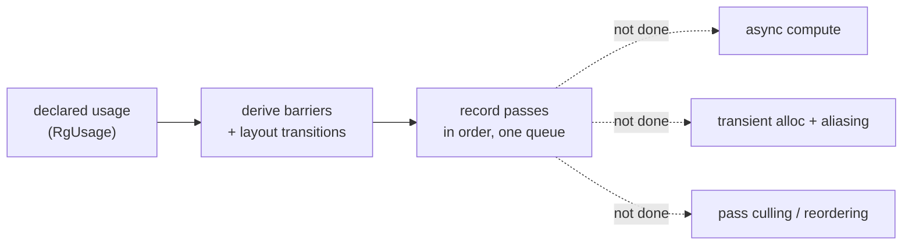

+++
title = 'Limits'
weight = 6
+++

# Limits

The limits of a render graph are the optimizations a mature graph can perform but a given
implementation chooses to leave out. Saffron's graph derives barriers and layout transitions from
declared usage and does nothing more; several features a fuller graph eventually grows are absent
by design.

Each omission has a seam already in place: the data a future feature would need is declared, so
adding it later is a contained change rather than a rewrite. The sections below name each limit,
its cost, and the seam that anticipates it.

## Single graphics queue

Every pass records into one command buffer on one graphics queue, in declaration order.
`executeRenderGraph` walks `graph.passes` start to finish and submits one command buffer. A pass
has no queue selection and there is no second timeline.

This rules out async compute, where a compute pass runs concurrently on a dedicated compute queue
while the graphics queue does other work. The light-cull and screen-space passes are compute, but
they run inline on the graphics queue, serialized by the same barriers as everything else.

The seam is `RgPass::kind` (`Graphics` / `Compute`) and a barrier model that is stage- and
access-based rather than queue-based. Adding a queue field and a cross-queue semaphore where the
timeline splits is the work; the usage declarations would not change.

## No transient resources, no aliasing

The graph allocates nothing. Every resource is imported — an existing renderer-owned handle
registered with `importImage` / `importBuffer` each frame. There are no graph-created images and
no memory aliasing, which reuses one allocation for two resources whose lifetimes do not overlap.

The cost is memory. The G-buffer normal target, the AO maps, the FXAA scratch, and the TAA history
and motion targets each hold their own allocation for the whole frame, though many never overlap in
time. A graph that allocated transients could fold several into one backing allocation.

The seam is the separation of imports from tracked state: `importImage` builds an `RgResourceState`,
and the resource table is a plain vector. A transient would be a resource the graph allocates lazily
and frees at end of frame, slotting into the same table. The right-sized targets that exist today
are the first candidates to alias.

## No pass culling

The graph records every pass it is given; there is no reachability analysis that drops a pass whose
outputs nothing reads. In practice this rarely matters, because the engine builds the graph
conditionally. `beginFrameGraph` adds the shadow pass only when a shadow is pending and the G-buffer
only when a screen-space effect is on. The construction is pruned even though the graph never culls.

The seam is the read and write declaration on every pass, which is exactly the information a
dead-pass cull would need. The analysis is unwritten because conditional construction already covers
the common case.

## No scheduling or reordering

Passes execute in the order they were added. The graph does not reorder them to overlap work or
minimize barriers. This keeps the per-frame state in `applyAccess` a simple running summary that
reasons only about the previous touch, never about a reordered schedule.

The trade is that a good order is the author's responsibility, not the graph's. For a single-queue
frame with a handful of passes that is the right call; a large graph with many independent branches
would benefit from a scheduler.

## One subresource per barrier

`applyAccess` emits barriers against the full image — a single mip and a single array layer. The
graph tracks one layout per resource, not per mip or per layer. Images with multiple mips or layers
that need different layouts at once cannot be expressed. The omnidirectional point-shadow cube, for
instance, is handled outside the graph rather than as a six-layer attachment.

The seam is the tracked state, which would grow from one layout to a per-subresource set, with
`applyAccess` comparing ranges. The single-subresource assumption is baked into the barrier
construction, so this is the most invasive of the listed changes.

The graph is a correctness tool, not a scheduler or an allocator. It removes the error-prone,
repetitive part of Vulkan and leaves the performance-shaping parts for when they are needed, with
the data they would require already declared.

## In the code

| What | File | Symbols |
|---|---|---|
| Single-queue execution | `render_graph.cppm` | `executeRenderGraph` |
| Import-only resources | `render_graph.cppm` | `importImage`, `importBuffer` |
| Full-image subresource | `render_graph.cppm` | `applyAccess` |
| Pass kind (the async seam) | `render_graph.cppm` | `RgPass::kind`, `RgPassKind` |
| Conditional construction | `renderer.cppm` | `beginFrameGraph` (the `do*` gates) |

## Related

- [Render graph](../render-graph-overview/) — the model and its closing caveat
- [Cross-frame layouts](../cross-frame-layouts/) — why import-only is what cross-frame persistence relies on
- [Barrier derivation](../usage-and-barrier-derivation/) — the single-subresource, in-order barrier model
- [Adding passes](../who-can-add-passes/) — the app seam that already exists
