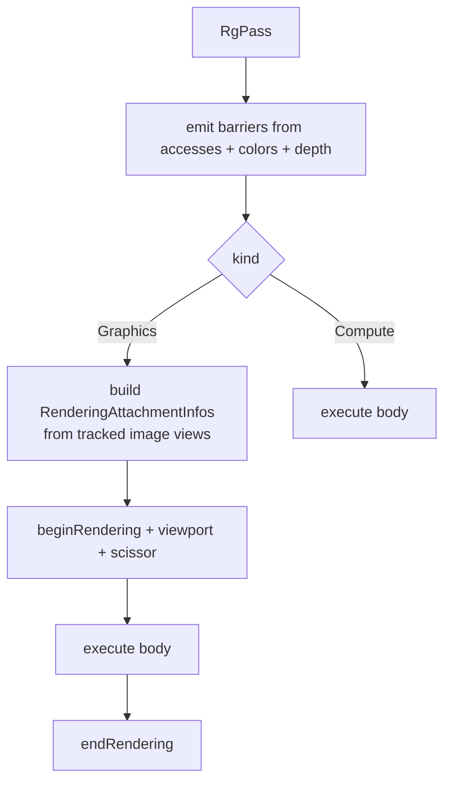

+++
title = 'Passes'
weight = 2
+++

# Passes

A pass is the unit the graph schedules, and it is plain data: a name, a kind, the resources it
touches, the attachments it renders into, and a closure that records the draws or dispatch. The
graph never asks a pass how to synchronize itself. The pass states what it does, and the graph
derives the rest.

```cpp
struct RgPass
{
    std::string name;
    RgPassKind kind;                                // Graphics or Compute
    std::vector<RgAccess> accesses;                 // non-attachment reads/writes
    std::vector<RgAttachment> colors;               // MRT: index 0 == location 0
    std::optional<RgAttachment> depth;
    vk::Extent2D renderArea;
    std::function<void(vk::CommandBuffer)> execute; // the body
};
```

The `kind` decides what the graph does around the body. A `Graphics` pass gets a
dynamic-rendering scope plus a full-area viewport and scissor; a `Compute` pass gets nothing but
its barriers. Otherwise both run the same way: emit the barriers the body needs, then call
`execute(cmd)`. The closure does ordinary recording — bind a pipeline and descriptor sets, push
constants, draw or dispatch — and never writes a barrier or transitions a layout.

## Accesses vs. attachments

A pass declares its resource use in two places, and the split is deliberate.

`accesses` is the list of non-attachment reads and writes: a storage buffer a compute shader
writes, a map the scene fragment shader samples, an image read and written in place. Each is an
`RgAccess` — a resource handle plus one `RgUsage` that says what the pass does with it.

`colors` and `depth` are the render targets of a graphics pass. They aren't listed in `accesses`
because their usage is implied: every entry in `colors` is a `ColorWrite`, and `depth` is a
`DepthWrite`. The graph applies those itself, so a pass author never repeats them.

```cpp
struct RgAttachment
{
    RgResource resource;
    vk::AttachmentLoadOp loadOp  = vk::AttachmentLoadOp::eClear;
    vk::AttachmentStoreOp storeOp = vk::AttachmentStoreOp::eStore;
    vk::ClearValue clearValue{};
    std::optional<RgResource> resolve;
};
```

So an attachment declares only its load/store/clear. Whether it needs a barrier, which layout it
transitions to, and how it orders against the previous pass are all derived from the implied
usage.

> [!NOTE]
> A color attachment is *not* an `RgAccess`. Listing it in both places would double-apply
> `ColorWrite` and emit a spurious second barrier. Put render targets in `colors`/`depth` and
> only non-attachment reads/writes in `accesses`.

## Multiple render targets

`colors` is a vector, so a pass can write more than one color attachment. The G-buffer pass uses
this: it writes a view-normal target and lays down depth in one pass for the screen-space effects
to read. Index order matters — `colors[0]` is shader output location 0, `colors[1]` is location
1 — and the graph builds one `vk::RenderingAttachmentInfo` per entry. Most passes have a single
color (the offscreen); the G-buffer is the case that makes the vector earn its keep.

## Load, store, clear

The three attachment ops control data flow into and out of the pass:

- **loadOp** — `eClear` starts from `clearValue`; `eLoad` keeps what is there. The scene pass
  clears depth normally, but when a depth pre-pass already ran it loads that depth (`eLoad`) and
  shades only the front-most fragments.
- **storeOp** — `eStore` writes the result back; `eDontCare` discards it. With MSAA the scene
  color uses `eDontCare` because the multisampled samples are thrown away after they resolve.
- **clearValue** — what `eClear` writes. Depth clears to `1.0`, the scene color to the frame's
  clear color.

## The resolve target

An `RgAttachment` can carry an optional `resolve` resource. This is the MSAA path: the pass
renders into a multisampled color attachment, and at end-of-pass the hardware resolves it into
the single-sample `resolve` image. The graph treats the resolve target as a second color write —
it runs `applyAccess` on it with `ColorWrite` so it gets its own barrier and transition, then
wires it in with `resolveMode = eAverage`. The scene pass with MSAA sets `storeOp = eDontCare` on
the multisampled color and points `resolve` at the offscreen; the clean image lands there, and
the graph derived both transitions.

## How a graphics pass is recorded



The image views the rendering scope binds come from the graph's tracked resource state, not from
the attachment struct — the attachment only names a resource handle, and the graph holds the
`vk::ImageView` it was imported with. That keeps the pass declaration free of Vulkan handles past
the import.

## In the code

| What | File | Symbols |
|---|---|---|
| Pass shape | `render_graph.cppm` | `RgPass`, `RgPassKind` |
| Attachment shape | `render_graph.cppm` | `RgAttachment`, load/store/clear/resolve |
| Non-attachment access | `render_graph.cppm` | `RgAccess`, `RgUsage` |
| Recording a pass | `render_graph.cppm` | `executeRenderGraph` |
| MRT + resolve in practice | `renderer.cppm` | `gbuffer` pass (two `colors`), `scene` pass (`resolve`) |

## Related

- [Render graph](../render-graph-overview/) — the model these passes live in
- [Barrier derivation](../usage-and-barrier-derivation/) — how `ColorWrite` becomes a barrier
- [Adding passes](../who-can-add-passes/) — where these passes get built each frame
- [Anti-aliasing](../../screen-space-and-post/) — the MSAA resolve the `resolve` target serves
