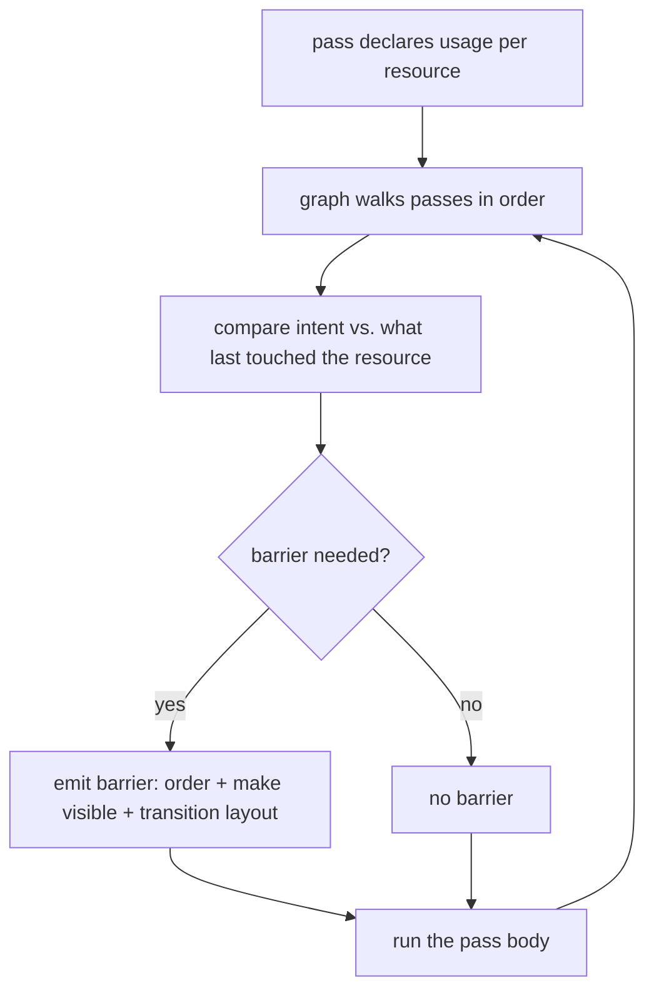

+++
title = 'Render graph'
weight = 1
+++

# Render graph

A render graph (also called a *frame graph*) describes one frame of rendering as a directed graph:
the passes are the nodes, and the images and buffers they read and write are the edges. Each pass
declares the resources it consumes and produces. From those declarations the graph derives
everything that connects the passes — their order, their dependencies, and the GPU synchronization
that makes one pass's output safe for the next to read.

The pattern separates two concerns that are easy to tangle: *what* a frame draws, and *how* the GPU
is synchronized while it draws. It originated with Frostbite's renderer (2017) and is now standard
in engines built on explicit graphics APIs.

## How it works

The graph runs in two phases each frame. First, every pass is recorded into the graph along with
its declared resource usage — no GPU commands execute yet. Second, the graph walks the passes in
dependency order, derives the synchronization each transition needs, and records the pass bodies.

The single idea underneath is *declare intent, derive the mechanics*. A pass never issues a
synchronization command itself; it only states how it uses each resource, and the graph computes
the rest from the sequence of declarations.

## Why Vulkan needs it

Vulkan is an explicit API: the driver performs almost no synchronization on your behalf. A GPU
pipelines work, so a command that writes an image and a later command that reads it can overlap
unless you order them. Without that ordering the read sees incomplete data, and there is no driver
safety net — only a corrupted frame, a hang, or a validation error.

Ordering GPU work in Vulkan means inserting a **pipeline barrier**, which expresses three things:

- **Execution dependency** — work in one set of pipeline stages must finish before work in another
  begins.
- **Memory dependency** — the first work's writes must be made visible to the second, flushing and
  invalidating GPU caches as needed.
- **Layout transition** (images only) — an image's memory layout must match its next use, since the
  layout that is optimal as a color attachment differs from the one a shader samples.

Each pass interacts with the resources of passes before and after it, so the barriers to reason
about multiply as a renderer grows. Hand-written, per-pass barriers are the part of a Vulkan
renderer that breaks first. The render graph removes that work by deriving every barrier from the
declared usage.

## What a render graph can do

Declared usage is enough to derive barriers; the same dependency information enables further
optimizations that graphs may or may not implement:

- **Barrier derivation** — order accesses, make writes visible, and transition layouts. The core
  job, and the only one a graph must do.
- **Resource aliasing** — knowing each resource's first and last use, share memory between
  resources whose lifetimes do not overlap.
- **Pass culling** — drop a pass whose outputs nothing reads.
- **Async scheduling** — move independent passes onto a separate queue to run concurrently.

## In Saffron

Saffron's graph implements the core job and leaves the optimizations as seams. A pass is a small
struct — a name, its resource accesses, its attachments, and a closure that records the draw or
dispatch. Each access carries one `RgUsage` value (`ColorWrite`, `SampledRead`,
`StorageImageRWCompute`, …), and a table maps each case to the stage, access mask, and layout a
barrier needs.

The graph allocates nothing. Resources are *imported*: `importImage` and `importBuffer` register an
existing Vulkan handle and return an index the passes refer to. The graph is rebuilt from scratch
each frame, which costs little and keeps the per-frame state simple to reason about. There are no
`VkRenderPass` or `VkFramebuffer` objects — Saffron targets Vulkan 1.4 and binds attachments
per-pass through dynamic rendering.

Engine passes (light culling, the scene pass, shadows, post-processing) are added at the start of
the frame; an application adds its own afterward. Both use the same declaration mechanism, so their
barriers are derived identically.

> [!NOTE]
> This is a single-graphics-queue graph that does the core job only. Every resource is a persistent,
> renderer-owned image imported each frame, so there is no transient allocation, aliasing, pass
> culling, or async compute. These are deliberate omissions with seams left for them — see
> [limits](../limits-and-seams/).

## In the code

| What | File | Symbols |
|---|---|---|
| Usage vocabulary | `render_graph.cppm` | `RgUsage`, `usageInfo` |
| Pass + attachment data | `render_graph.cppm` | `RgPass`, `RgAttachment`, `RgAccess` |
| Import resources | `render_graph.cppm` | `importImage`, `importBuffer`, `addPass` |
| Barrier derivation | `render_graph.cppm` | `applyAccess`, `RgResourceState` |
| Execution | `render_graph.cppm` | `executeRenderGraph` |
| Where engine passes are added | `renderer.cppm` | `beginFrameGraph`, `frameGraph` |

## Related

- [Barrier derivation](../usage-and-barrier-derivation/) — how one `RgUsage` becomes one barrier, in detail
- [Passes](../passes-and-attachments/) — MRT, resolve, load/store, the execute closure
- [Cross-frame layouts](../cross-frame-layouts/) — carrying image layouts across the frame boundary
- [Adding passes](../who-can-add-passes/) — engine passes vs. application passes
- [Synchronization2](../../vulkan-foundation/synchronization2-and-barriers/) — the barrier primitives the graph emits
- [Dynamic rendering](../../vulkan-foundation/dynamic-rendering/) — the no-render-pass model the graph rides on
