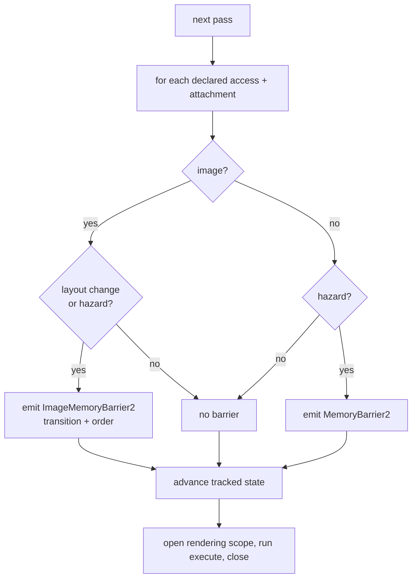

+++
title = 'Render graph'
weight = 1
+++

# Render graph

Vulkan makes you responsible for synchronization. Before a shader samples an image you wrote
as a color attachment, you owe the driver a barrier that transitions its layout and orders the
write before the read. Get one wrong and you get a validation error, a corrupted frame, or a
hang. Writing those barriers by hand, per pass, is where Vulkan renderers rot.

The render graph removes that job. A pass *declares* what it does with each resource, and the
graph reads those declarations and emits the barriers and layout transitions itself. No pass in
the engine writes a `pipelineBarrier2` call.

## Declaration vocabulary

A pass's intent toward a resource is one `RgUsage` value. Each case maps to a pipeline stage,
an access mask, and (for images) a layout — `ColorWrite` is a color-attachment write that wants
`eColorAttachmentOptimal`, `SampledRead` is a fragment-shader read that wants
`eShaderReadOnlyOptimal`, and so on through the compute and storage cases. `usageInfo(usage)`
expands a case into its `{ stage, access, layout, isWrite }`, and that table is the only place
the mappings live. The [barrier derivation](../usage-and-barrier-derivation/) page lists all of
them.

## A pass is data plus a closure

```cpp
struct RgPass
{
    std::string name;
    RgPassKind kind;                                // Graphics or Compute
    std::vector<RgAccess> accesses;                 // non-attachment reads/writes
    std::vector<RgAttachment> colors;               // MRT: index 0 == location 0
    std::optional<RgAttachment> depth;
    vk::Extent2D renderArea;
    std::function<void(vk::CommandBuffer)> execute; // the body
};
```

Attachments declare only their load/store/clear; the `ColorWrite`/`DepthWrite` usage and the
layout transition are derived. The `colors` vector is what makes multiple render targets work —
the thin G-buffer writes color and a normal target from one pass — and an attachment can also
carry a `resolve` target, which is how MSAA resolves into the offscreen.

The graph allocates nothing. Resources are *imported*: `importImage` and `importBuffer` register
an existing Vulkan handle and return an `RgResource` index. The offscreen color, the swapchain
image, the depth buffer, and the light buffers are all imported each frame.

## Deriving a barrier

The graph tracks a small state per resource as it walks the passes in order: current layout, the
last stage and access that touched it, and whether that touch was a write. `applyAccess` compares
the incoming usage against that state and decides whether a barrier is needed:

```cpp
const bool hazard = (target.isWrite && r.touched) || (!target.isWrite && r.lastWasWrite);
```

A write after the resource has been touched at all is a hazard (write-after-write or
write-after-read). A read after a write is a hazard (read-after-write). Read-after-read is not,
and emits nothing.

Images have a second trigger: a layout change. If the resource's current layout differs from the
usage's required layout, the graph emits a `vk::ImageMemoryBarrier2` that both transitions the
layout and orders the access, even with no data hazard. Buffers have no layout, so they barrier
only on a hazard, via a `vk::MemoryBarrier2`. After emitting, `applyAccess` advances the tracked
state so the next pass sees the new reality.



## Executing the frame

`executeRenderGraph` runs once per frame with the frame's command buffer. For each pass it
collects the barriers from every declared access and attachment (plus any resolve), submits them
in one `pipelineBarrier2`, then runs the body. A graphics pass first opens a dynamic-rendering
scope from the tracked image views (`beginRendering`, a full-area viewport and scissor) and
closes it after; a compute pass just runs.

There are no `VkRenderPass` or `VkFramebuffer` objects here. The engine targets Vulkan 1.3, so
attachments bind per-pass through dynamic rendering, which is exactly what a per-frame graph
wants.

## Layouts across the frame boundary

The offscreen image is sampled by ImGui at the end of one frame and written as a color attachment
at the start of the next. If the graph reset every image to `eUndefined` each frame, it would
emit a needless transition every time. `importImage` takes an `externalLayout` pointer: it seeds
the resource's entry layout from it, and after execution writes the resolved layout back.
`seedImageState` also reconstructs the right source scope, so the first barrier waits on whatever
last touched the image. Layouts carry across frames and the spurious transitions disappear. See
[cross-frame layouts](../cross-frame-layouts/).

## What it is, what it isn't

Every frame the graph is rebuilt from scratch. It's cheap (a couple of vectors) and keeps the
per-frame state trivially correct. The engine's cull → scene → UI passes are added in
`beginFrameGraph`; app layers then add their own in `onRenderGraph`
(see [adding passes](../who-can-add-passes/)).

> [!NOTE]
> This is a single-graphics-queue graph with no transient allocation and no aliasing: every
> target is a persistent, renderer-owned image imported each frame. There's no async compute and
> no automatic culling of unused passes. These are deliberate omissions with seams left for them.
> See [limits](../limits-and-seams/).

## In the code

| What | File | Symbols |
|---|---|---|
| Usage vocabulary | `render_graph.cppm` | `RgUsage`, `usageInfo` |
| Pass + attachment data | `render_graph.cppm` | `RgPass`, `RgAttachment`, `RgAccess` |
| Import resources | `render_graph.cppm` | `importImage`, `importBuffer`, `addPass` |
| Barrier derivation | `render_graph.cppm` | `applyAccess`, `RgResourceState` |
| Cross-frame layout | `render_graph.cppm` | `seedImageState`, `externalLayout` |
| Execution | `render_graph.cppm` | `executeRenderGraph` |
| Where engine passes are added | `renderer.cppm` | `beginFrameGraph`, `frameGraph` |

## Related

- [Passes](../passes-and-attachments/) — MRT, resolve, load/store
- [Barrier derivation](../usage-and-barrier-derivation/) — the full hazard table
- [Cross-frame layouts](../cross-frame-layouts/)
- [Dynamic rendering](../../vulkan-foundation/dynamic-rendering/) — the no-render-pass model the graph rides on
