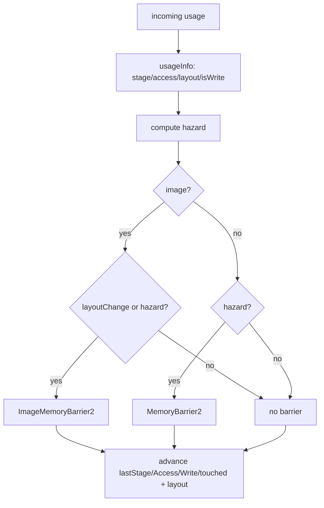

+++
title = 'Barrier derivation'
weight = 3
+++

# Barrier derivation

This is the core of the render graph: how one `RgUsage` value on a resource turns into a correct
Vulkan barrier. The whole thing is two small functions. `usageInfo` maps a usage to its
synchronization scope, and `applyAccess` compares that scope against what last touched the
resource and emits a barrier only when it has to.

## Usage is the single source of truth

A pass states its intent as one `RgUsage`. `usageInfo` expands the enum case into the four facts
a barrier needs — `{ stage, access, layout, isWrite }` — and that switch is the only place these
correspondences live.

| `RgUsage` | Stage | Access | Layout | Write? |
|---|---|---|---|---|
| `ColorWrite` | ColorAttachmentOutput | ColorAttachmentWrite | ColorAttachmentOptimal | yes |
| `DepthWrite` | Early + LateFragmentTests | DepthStencilAttachmentWrite | DepthAttachmentOptimal | yes |
| `SampledRead` | FragmentShader | ShaderSampledRead | ShaderReadOnlyOptimal | no |
| `StorageWriteCompute` | ComputeShader | ShaderStorageWrite | (buffer) | yes |
| `StorageReadCompute` | ComputeShader | ShaderStorageRead | (buffer) | no |
| `StorageReadFragment` | FragmentShader | ShaderStorageRead | (buffer) | no |
| `StorageImageRWCompute` | ComputeShader | StorageRead + StorageWrite | General | yes |
| `SampledReadCompute` | ComputeShader | ShaderSampledRead | ShaderReadOnlyOptimal | no |

A few choices read off the table. `DepthWrite` spans both fragment-test stages because depth is
touched in both. `StorageImageRWCompute` is a write in `GENERAL` — the in-place read-modify-write
layout the tonemap and FXAA passes use. The buffer usages carry `eUndefined` for layout because
buffers have none, which the barrier logic relies on.

## The hazard line

`applyAccess` gets the incoming usage's info and the resource's current tracked state. The
dependency decision is one boolean:

```cpp
const bool hazard = (target.isWrite && r.touched) || (!target.isWrite && r.lastWasWrite);
```

A write that follows any prior touch is a hazard — `target.isWrite && r.touched` covers
write-after-write and write-after-read, both of which need the prior access to finish first. A
read that follows a write is the classic read-after-write. What's *not* on this line is
read-after-read: two reads don't conflict, so `hazard` stays false and no barrier is emitted.
That is the one case the graph is careful to skip.

## Images get a second trigger

A buffer barriers only on a hazard. An image has a second reason: a layout change. Even with no
data hazard, if the resource sits in one layout and the incoming usage requires another, it must
transition.

```cpp
if (r.isImage)
{
    const bool layoutChange =
        target.layout != vk::ImageLayout::eUndefined && r.layout != target.layout;
    if (layoutChange || hazard) { /* ImageMemoryBarrier2 */ }
}
else if (hazard) { /* MemoryBarrier2 (no layout) */ }
```

The image path emits a `vk::ImageMemoryBarrier2`. Its source scope is whatever last touched the
resource (`r.lastStage`, `r.lastAccess`); its destination scope is the incoming usage's stage and
access. `oldLayout` is always the current layout, and `newLayout` differs only on a layout change
— so a barrier emitted purely to order a hazard has matching layouts, does no transition, and
still installs the execution and memory dependency.

The buffer path emits a `vk::MemoryBarrier2`, which has no layout fields. The `target.layout !=
eUndefined` guard is what keeps a buffer (whose usages all carry `eUndefined`) from ever
triggering the layout path.

## Advancing the state

After deciding and possibly emitting, `applyAccess` rolls the tracked state forward so the next
pass sees the new reality: `lastStage`, `lastAccess`, `lastWasWrite`, `touched`, and (for images
on a layout change) `layout`. This is what makes the next pass's checks correct without any
global analysis. The state is a running summary of what last happened to a resource, updated one
access at a time as the passes are walked in order.



> [!NOTE]
> The hazard line treats a write after any prior touch as conflicting, including write-after-read.
> That is conservative but correct: it never misses a hazard. It also never coalesces or reorders
> — each access emits at most one barrier, walked strictly in pass order, so the cost is one
> barrier per real transition and nothing for read-after-read.

## In the code

| What | File | Symbols |
|---|---|---|
| Usage → scope mapping | `render_graph.cppm` | `usageInfo`, `RgUsageInfo` |
| The hazard decision | `render_graph.cppm` | `applyAccess` |
| Tracked state | `render_graph.cppm` | `RgResourceState` |
| Where barriers are collected | `render_graph.cppm` | `executeRenderGraph` |

## Related

- [Render graph](../render-graph-overview/) — the model this derivation serves
- [Passes](../passes-and-attachments/) — where `ColorWrite`/`DepthWrite` come from implicitly
- [Cross-frame layouts](../cross-frame-layouts/) — how the entry layout seeds the first barrier
- [Synchronization2](../../vulkan-foundation/) — the barrier primitives this emits
