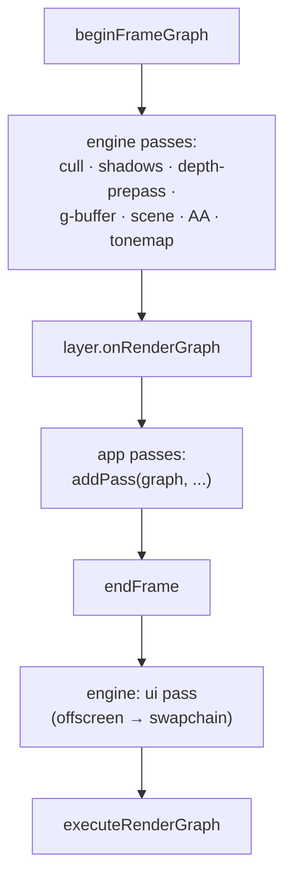

+++
title = 'Adding passes'
weight = 5
+++

# Adding passes

The frame graph is built in three windows of one main-loop iteration: the engine lays down its
own passes first, app layers add theirs in the middle, and the engine closes with the UI pass and
executes. The ordering lets an app drop a post-process into the frame without touching engine
code, and have it land in the right place.

## The three windows

The loop in `run` does this per frame, after recording ImGui:

```cpp
beginFrameGraph(app.renderer);            // 1. engine: cull → scene → AA → tonemap
for (Layer& layer : app.layers)
{
    if (layer.onRenderGraph) { layer.onRenderGraph(frameGraph(app.renderer)); }  // 2. app passes
}
endFrame(app.renderer);                   // 3. engine: ui pass, then execute
```

1. **`beginFrameGraph`** rebuilds the graph and adds every engine-internal pass: light culling,
   shadow depth passes, the optional depth pre-pass, the G-buffer and screen-space effects, the
   scene pass, the FXAA/TAA resolve, and the mandatory tonemap. By the time it returns, the
   offscreen holds the finished, tonemapped scene.
2. **`onRenderGraph`** is the layer hook. Each attached layer that defines it is handed the live
   `RenderGraph&` and can call `addPass` to insert its work. This runs after the scene and
   tonemap, before the UI pass.
3. **`endFrame`** adds the UI pass — sample the offscreen, composite ImGui into the swapchain —
   then calls `executeRenderGraph` to derive every barrier and record the whole thing.

Because the UI pass is added last, anything a layer adds in window 2 is recorded before ImGui
composites. An app post-process sees the engine's finished image and modifies it before it
reaches the screen.



## What a layer gets

`frameGraph(renderer)` returns a reference to the current graph; the layer adds to it with the
same `addPass` the engine uses. The engine exposes the offscreen color through
`viewportColorResource(renderer)` (the same `RgResource` it tracks as `sceneColor`), so an
in-place compute post-process imports nothing new: it declares `StorageImageRWCompute` on the
offscreen handle, binds its pipeline, and dispatches.

A layer pass and an engine pass are the same thing to the graph. The layer's pass goes through
`applyAccess` identically, and its read-modify-write transition (`Color → General →
ShaderReadOnly`) is derived, not coded. The engine's own tonemap uses the same machinery from
inside `endFrame`.

## Engine passes are conditional

`beginFrameGraph` is not a fixed pipeline. Almost every engine pass is gated on a flag and the
presence of its pipeline and target:

```cpp
const bool doCull         = renderer.lighting.clusterDispatchPending && renderer.pipelines.cull;
const bool doShadow       = renderer.lighting.shadowPending && renderer.pipelines.shadowDepth && ...;
const bool doDepthPrepass = renderer.useDepthPrepass && renderer.pipelines.depthPrepass;
const bool doScreen       = doSsao || doContact || doSsgi || wantRestir;
```

So the graph for a given frame contains only the passes that frame needs. Turn off shadows and
the shadow pass isn't added — and because the scene pass only declares a `SampledRead` on the
shadow map when `doShadow` is true, no dangling barrier references a resource that was never
imported. Conditional construction keeps the declared usage and the imported resources in
lockstep.

## The submit() seam, layered on top

There are two ways app geometry reaches the GPU, and they coexist. The `onRenderGraph` hook adds
whole passes. The older `submit(renderer, fn)` / `submitUi(renderer, fn)` seam pushes a closure
*replayed inside* an existing engine pass — scene submissions run inside the scene pass body, UI
submissions inside the UI pass body:

```cpp
scene.execute = [&renderer](vk::CommandBuffer cmd)
{
    recordSceneDrawList(renderer, cmd);
    for (RenderFn& fn : renderer.frame.sceneSubmissions) { fn(cmd); }
};
```

A layer that just wants to draw more geometry into the scene uses `submit`; a layer that wants its
own synchronized pass (a compute effect, a separate target) uses `onRenderGraph`. The first rides
inside the engine's barriers; the second gets its own, derived.

> [!NOTE]
> The tonemap is added inside `beginFrameGraph`, so it runs before `onRenderGraph`. A layer
> post-process therefore operates on already-tonemapped, display-referred color, not linear HDR.
> A layer that needs linear radiance must insert its pass another way; the engine's own linear-HDR
> consumers (SSGI history capture) are added before the tonemap.

## In the code

| What | File | Symbols |
|---|---|---|
| The three-window order | `app.cppm` | `run` (`beginFrameGraph` → `onRenderGraph` → `endFrame`) |
| The layer hook | `app.cppm` | `Layer::onRenderGraph` |
| Engine passes | `renderer.cppm` | `beginFrameGraph` (`do*` flags + `addPass`) |
| Handing the graph to layers | `renderer.cppm` | `frameGraph`, `viewportColorResource` |
| UI pass + execute | `renderer.cppm` | `endFrame`, `addTonemapPass` |
| Replay-into-pass seam | `renderer.cppm` | `submit`, `submitUi`, `sceneSubmissions` |

## Related

- [Render graph](../render-graph-overview/) — the model the passes are added to
- [Passes](../passes-and-attachments/) — what `addPass` takes
- [Limits](../limits-and-seams/) — what app passes still can't do
- [Compute post-process](../../screen-space-and-post/) — the RMW shape a layer pass follows
