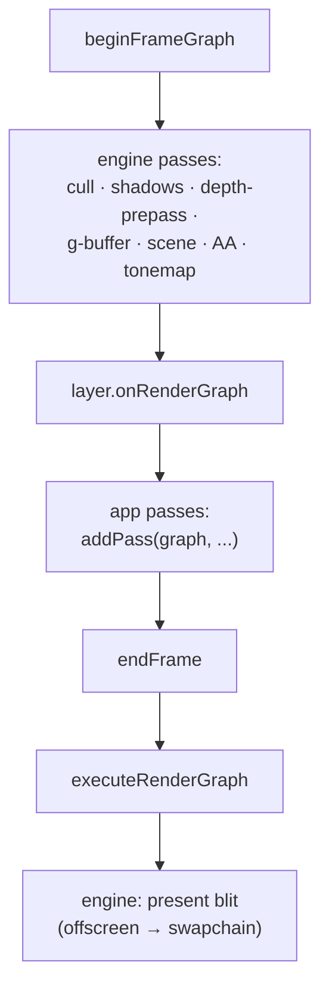

+++
title = 'Adding passes'
weight = 5
+++

# Adding passes

A frame graph is assembled in three ordered windows of a single main-loop iteration: the engine
lays down its own passes, app layers add theirs, and the engine closes by executing the graph and
blitting the offscreen to the swapchain. The order lets an app insert a pass — a post-process, a
compute effect — at a defined point in the frame without touching engine code.

## The three windows

The loop in `run` does this per frame, after the `onUi` phase:

```cpp
beginFrameGraph(app.renderer);            // 1. engine: cull → scene → AA → tonemap
for (Layer& layer : app.layers)
{
    if (layer.onRenderGraph) { layer.onRenderGraph(frameGraph(app.renderer)); }  // 2. app passes
}
endFrame(app.renderer);                   // 3. engine: execute, then blit to swapchain
```

1. **`beginFrameGraph`** rebuilds the graph and adds every engine-internal pass: light culling,
   shadow depth passes, the optional depth pre-pass, the G-buffer and screen-space effects, the
   scene pass, the FXAA/TAA resolve, and the mandatory tonemap. By the time it returns, the
   offscreen holds the finished, tonemapped scene.
2. **`onRenderGraph`** is the layer hook. Each attached layer that defines it is handed the live
   `RenderGraph&` and can call `addPass` to insert its work. This runs after the scene and
   tonemap, before the graph executes.
3. **`endFrame`** calls `executeRenderGraph` to derive every barrier and record the whole thing,
   then blits the finished offscreen to the swapchain with `presentViewportToSwapchain`.

The present blit is last, so anything a layer adds in window 2 is recorded before the offscreen is
read out. An app post-process sees the engine's finished image and modifies it before it
reaches the screen.



## What a layer gets

`frameGraph(renderer)` returns a reference to the current graph; the layer adds to it with the
same `addPass` the engine uses. The engine exposes the offscreen color through
`viewportColorResource(renderer)` — the same `RgResource` it tracks as `sceneColor` — so an
in-place compute post-process imports nothing new. It declares `StorageImageRWCompute` on the
offscreen handle, binds its pipeline, and dispatches.

A layer pass and an engine pass are identical to the graph. The layer's pass goes through
`applyAccess` the same way, and its read-modify-write transition (`Color → General →
ShaderReadOnly`) is derived, not coded. The engine's own tonemap uses the same machinery from
inside `endFrame`.

## Engine passes are conditional

`beginFrameGraph` is not a fixed pipeline. Almost every engine pass is gated on a flag and the
presence of its pipeline and target:

```cpp
const bool doCull         = renderer.lighting.clusterDispatchPending && renderer.pipelines.cull;
const bool doShadow       = renderer.lighting.shadowPending && renderer.pipelines.shadowDepth && ...;
const bool doDepthPrepass = renderer.useDepthPrepass && renderer.pipelines.depthPrepass;
const bool doScreen       = doSsao || doContact || doSsgi || wantRestir;
```

The graph for a given frame contains only the passes that frame needs. With shadows off, the
shadow pass is not added; the scene pass declares a `SampledRead` on the shadow map only when
`doShadow` is true, so no barrier references a resource that was never imported. Conditional
construction keeps the declared usage and the imported resources in lockstep.

## The submit() seam

App geometry reaches the GPU two coexisting ways. The `onRenderGraph` hook adds whole passes. The
`submit(renderer, fn)` seam pushes a closure *replayed inside* the scene pass body:

```cpp
scene.execute = [&renderer](vk::CommandBuffer cmd)
{
    recordSceneDrawList(renderer, cmd);
    for (RenderFn& fn : renderer.frame.sceneSubmissions) { fn(cmd); }
};
```

A layer that draws more geometry into the scene uses `submit`; a layer that needs its own
synchronized pass — a compute effect, a separate target — uses `onRenderGraph`. The first rides
inside the engine's barriers; the second gets its own, derived.

> [!NOTE]
> The tonemap is added inside `beginFrameGraph`, so it runs before `onRenderGraph`. A layer
> post-process therefore operates on already-tonemapped, display-referred color, not linear HDR.
> A layer that needs linear radiance must insert its pass another way; the engine's own linear-HDR
> consumers (SSGI history capture) are added before the tonemap.

## In the code

| What | File | Symbols |
|---|---|---|
| The three-window order | `app.cppm` | `run` (`beginFrameGraph` → `onRenderGraph` → `endFrame`) |
| The layer hook | `app.cppm` | `Layer::onRenderGraph` |
| Engine passes | `renderer.cppm` | `beginFrameGraph` (`do*` flags + `addPass`) |
| Handing the graph to layers | `renderer.cppm` | `frameGraph`, `viewportColorResource` |
| Execute + present blit | `renderer.cppm` | `endFrame`, `executeRenderGraph`, `presentViewportToSwapchain` |
| Replay-into-pass seam | `renderer.cppm` | `submit`, `sceneSubmissions` |

## Related

- [Render graph](../render-graph-overview/) — the model the passes are added to
- [Passes](../passes-and-attachments/) — what `addPass` takes
- [Limits](../limits-and-seams/) — what app passes still can't do
- [Compute post-process](../../screen-space-and-post/) — the RMW shape a layer pass follows
