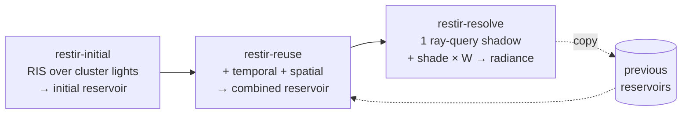

+++
title = 'ReSTIR'
weight = 9
math = true
+++

# ReSTIR

ReSTIR (Reservoir Spatiotemporal Importance Resampling) is the engine's many-light direct lighting
path. Instead of looping every light per pixel, each pixel keeps one *reservoir* — a single chosen
light plus a weight — and improves that choice over time and across neighbours by resampling. The
result is good direct lighting from many lights at the cost of one shadow ray per pixel.

> [!NOTE]
> ReSTIR is feature-gated on ray-query support and runs at ~1 FPS on the software dev GPU. It's
> correctness-validated and waits on real ray-tracing hardware.

## The reservoir

A reservoir is the state weighted reservoir sampling carries: the chosen light, the running weight
sum, the sample count $M$, and the unbiased contribution weight $W$. It packs into two `float4`s
(32 bytes, one per pixel): `a` holds the chosen light index, $W$, the weight sum, and $M$; `b`
holds the target pdf of the chosen sample.

## Resampled importance sampling

For one pixel we want to sample lights proportional to their actual contribution $\hat p$ (the
*target function*: a light's unshadowed radiance at this surface). We can't sample $\hat p$
directly, so RIS draws $K$ candidates from a cheap source distribution (here the pixel's froxel
cluster light list, uniform) and keeps one proportional to $\hat p / p_\text{source}$. Each
candidate's resampling weight is

$$
w_i = \frac{\hat p(x_i)}{p_\text{source}(x_i)}
$$

and weighted reservoir sampling keeps candidate $i$ with probability $w_i / \sum_j w_j$ in a single
streaming pass. The kept sample's unbiased contribution weight is

$$
W = \frac{1}{\hat p(x)}\cdot\frac{1}{K}\sum_{i} w_i
$$

so shading the chosen light and multiplying by $W$ gives an unbiased estimate of the sum over *all*
candidate lights — one light evaluated, many accounted for.

## Spatiotemporal reuse

The power of ReSTIR is that reservoirs combine. Two reservoirs merge by treating each as a single
weighted sample and running WRS again, so a pixel can borrow good light choices from its **own pixel
last frame** (reprojected via the [motion vector](../../screen-space-and-post/)) and from a few
**screen neighbours** with similar depth and normal. A merge accumulates $M$ and reweights the
incoming sample by its target function *at this pixel*, so a neighbour's light is only kept if it's
actually good here. Over frames, each pixel's reservoir effectively integrates thousands of
candidate evaluations while only ever storing one.

## The three passes

1. **Initial** — `restir_initial.slang` draws $K$ candidate lights from the froxel cluster and
   keeps one by RIS. No shadow ray (visibility is deferred).
2. **Reuse** — `restir_reuse.slang` merges the initial reservoir with last frame's (reprojected)
   and a few spatial neighbours, with M-clamping to bound bias.
3. **Resolve** — `restir_resolve.slang` traces the single shadow ray for the surviving sample,
   shades it scaled by $W$, writes the per-pixel direct radiance, and copies the combined reservoir
   into the previous buffer for next frame.

[ReSTIR passes](../restir-passes/) covers each in detail. The mesh fragment samples the resolved
radiance and adds it as the diffuse direct term (gated on `screenFlags.w`), replacing its per-light
loop — the sampled value already includes geometry × visibility × $W$, so the fragment only applies
`albedo / PI`.

## Why one ray, not a loop

The clustered-forward path loops every light in a pixel's cluster (capped at 64), each fully shaded,
none shadowed beyond the one map. ReSTIR collapses that to a single stochastic sample that's
importance-resampled to land on the lights that matter, then traces exactly one visibility ray for
it. With thousands of lights the clustered loop becomes a per-pixel bottleneck; ReSTIR's cost is
fixed at three compute passes plus one ray regardless of light count. The trade is noise (one sample
is noisy) against the temporal/spatial reuse and
[temporal accumulation](../../screen-space-and-post/) that smooth it.

## In the code

| What | File | Symbols |
|---|---|---|
| The reservoir struct | `restir_initial.slang` | `Reservoir` |
| RIS candidate sampling | `restir_initial.slang` | `computeMain`, `targetContribution` |
| Reuse + M-clamping | `restir_reuse.slang` | `combineInto` |
| Resolve + shade | `restir_resolve.slang` | `computeMain`, `rayShadow` |
| State + toggle | `renderer_types.cppm` | `Restir`; `renderer.cppm` · `setRestir`, `restirEnabled` |
| Sampling into shading | `mesh.slang` | the `screenFlags.w` branch |

> [!WARNING]
> ReSTIR is gated on `rtSupported` (it needs the TLAS for the one resolve ray) and on the G-buffer +
> froxel cull running. `setRestir` is a no-op otherwise.

## Related

- [ReSTIR passes](../restir-passes/) — initial, reuse, resolve in detail
- [Clustered forward](../../lighting-and-brdf/clustered-forward/) — the per-light loop ReSTIR replaces, and its candidate source
- [Ray-query shadows](../ray-query-shadows/) — the visibility ray the resolve pass uses
- [Cook-Torrance BRDF](../../lighting-and-brdf/cook-torrance-brdf/) — the shading the resolved radiance feeds
