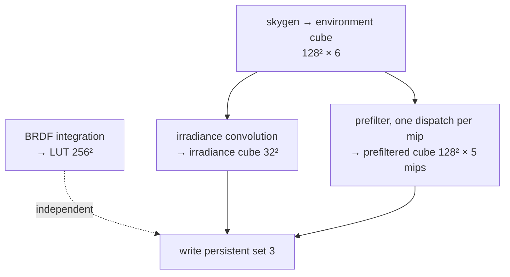

+++
title = 'Baking'
weight = 7
+++

# Baking

Baking is the precomputation of an environment's lighting into a fixed set of textures, run once so that runtime lighting reduces to a few texture fetches.

The four IBL shaders run inside one function, `bakeEnvironment`, called at startup, and produce the persistent set 3 the mesh shader samples every frame after. The bake is synchronous one-time work: its own command buffer, its own transient descriptors, and a `waitIdle` at the end. It sits outside the [per-frame render graph](../../frame-and-render-graph/render-graph-overview/).

## Why bake once, not per frame

The convolutions are heavy. The irradiance integral takes a thousand environment samples per texel, and the prefilter and LUT each importance-sample 64 to 512 directions per texel. None of this changes once the environment is fixed, so computing it per frame would spend the whole budget on a result identical to the last frame's. Amortized to startup, the runtime cost collapses to three texture fetches in the [ambient block](../ibl-overview/). The engine's other one-time GPU jobs share this shape: `uploadTexture` and `renderMeshThumbnail` also use their own command buffer plus a `waitIdle`.

## The four stages

The bake runs the shaders in dependency order, since the sky must exist before it can be convolved. The BRDF LUT is independent and runs last.

Each stage transitions its target to `eGeneral`, dispatches, then transitions to `eShaderReadOnlyOptimal`. The environment is the exception: after skygen writes it, it transitions to `eShaderReadOnlyOptimal` so the irradiance and prefilter passes can *sample* it. The barriers are written by hand here, outside the render graph, one `pipelineBarrier2` per transition. The dispatch grid is `(size+7)/8` groups in X and Y to match the shaders' `[numthreads(8,8,1)]`, and 6 in Z, one per cube face.

## Transient resources, freed at the end

The bake builds a private descriptor pool, two set layouts (storage-only for skygen and the LUT, sampler-plus-storage for the convolutions), the four compute pipelines, and the per-mip 2D-array storage views described in [cubemaps and mips](../cubemaps-and-mips/). All of this exists only for the bake. After the `waitIdle`, the transient views and layouts are destroyed.

The four images — environment, irradiance, prefiltered, LUT — persist, owned by `renderer.ibl`. The environment cube outlives the bake even though only the convolutions read it, kept as the source if a re-bake is ever wired up.

## Writing the persistent set

The last step writes the three samplers the mesh fragment binds as set 3 — irradiance, prefiltered, BRDF LUT — into `renderer.ibl.set`, then sets `ibl.ready = true`. The set layout and the empty set are allocated earlier in `initDescriptorResources`, so the mesh pipeline layout can reference set 3 before the bake fills it. The shared `ibl.sampler` is a linear/trilinear clamp-to-edge sampler with `maxLod = VK_LOD_CLAMP_NONE`, so the prefiltered mip chain filters across all levels.

## The runtime gate

The mesh shader samples set 3 only when `globals.counts.z != 0`, which is `useIbl && ibl.ready` — both the toggle and the bake-completed flag. IBL contributes the moment the bake finishes, and `se set-ibl 0` returns to the flat scalar ambient without touching the baked textures.

## In the code

| What | File | Symbols |
|---|---|---|
| The whole bake | `renderer_detail.cppm` | `bakeEnvironment` |
| Called at startup | `renderer.cppm` | after `initDescriptorResources` |
| Persistent set + sampler | `renderer_detail.cppm` | `renderer.ibl.set`, `ibl.sampler`, `ibl.ready` |
| Runtime gate | `renderer_lighting.cpp` | `iblFlag` → `counts.z` |
| Toggle | `renderer.cppm` / `control_commands_render.cpp` | `setIbl`, `iblEnabled`, `set-ibl` |

> [!NOTE]
> The bake submits on the graphics queue and calls `device.waitIdle()` to finish before returning. Fine at startup, but it would stall a running frame — deliberately a one-time init step, not a render-graph pass. A re-bake on a changed environment would need to fold these passes into the graph or schedule them off the main loop.

## Related

- [IBL overview](../ibl-overview/) — what set 3 feeds at runtime
- [Cubemaps and mips](../cubemaps-and-mips/) — the image + transient-view setup the bake uses
- [Procedural sky](../procedural-sky/) — stage one of the bake
- [Render graph overview](../../frame-and-render-graph/render-graph-overview/) — the per-frame system this bake sits outside of
