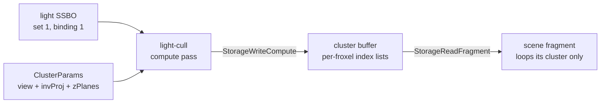

+++
title = 'Clustered forward'
weight = 5
math = true
+++

# Clustered forward

A forward renderer that loops every light per fragment scales badly: a thousand lights means
a thousand iterations per pixel, most contributing nothing. Clustered forward (Forward+) dices
the view frustum into a 3D grid of froxels, a compute pass assigns each light to the froxels
it touches, and the fragment shader loops only the lights in its froxel.

## The froxel grid

The grid is $16 \times 9 \times 24 = 3456$ clusters. The $16 \times 9$ tiles the screen; the
24 slices it in depth. Depth slicing is exponential in view space, not linear, because
perspective packs near geometry into a thin band of screen depth — equal-thickness slices
would waste resolution far away and starve it up close. Slice $i$ spans the view-space Z planes

$$
z_i = -n\left(\frac{f}{n}\right)^{i/N}, \qquad i = 0 \dots N
$$

where $n$ and $f$ are the near and far planes and $N$ is the slice count. Z is negative
because the camera looks down $-Z$. The cull shader builds each slice with `pow(far/near, ...)`;
the fragment shader inverts the same mapping with a `log` — see [cluster indexing](../cluster-indexing/).

## The cull pass

`light_cull.slang` runs one invocation per cluster (a flat `[numthreads(64,1,1)]` dispatch of
`(ClusterCount + 63) / 64` groups). Each invocation unpacks its `(x, y, z)` grid coordinate,
builds the cluster's view-space AABB by back-projecting the screen tile's corners onto the near
plane and intersecting those eye rays with the slice's two Z planes, then tests every light as
a sphere-vs-box check:

```hlsl
float3 closest = clamp(posView, aabbMin, aabbMax);   // nearest box point to the light
float3 delta = posView - closest;
if (dot(delta, delta) <= radius * radius)            // sphere overlaps box
{
    if (count < MAX_LIGHTS_PER_CLUSTER)
    {
        clusters[clusterIndex].indices[count] = i;
        count = count + 1;
    }
}
```

The light's bounding radius is its `range`, which works precisely because punctual
[attenuation](../punctual-lights-and-attenuation/) is windowed to reach zero at `range`, so a
light truly contributes nothing outside its sphere. The result per froxel is a `Cluster`: a
`count` plus a fixed array of light indices.



## How it slots into the frame

The cull pass is added to the [render graph](../../frame-and-render-graph/render-graph-overview/)
in `beginFrameGraph`, before the scene pass, when `clusterDispatchPending` is set (clustered
mode on and at least one light). It declares the cluster buffer as `StorageWriteCompute`; the
scene pass declares it as `StorageReadFragment`. The graph derives the compute→fragment barrier
from those two declarations, no hand-written `pipelineBarrier2`. The same light SSBO is bound
into both the cull set and the fragment lighting set, so growing it rewrites both.

## Why it stays correct

The cull is an optimization, not a different lighting model. It changes which lights a fragment
iterates, never how a light is shaded — both this loop and the
[brute-force loop](../brute-force-fallback/) call the same `punctual`/`brdf` functions. A light
is added to a cluster only when its `range` sphere overlaps the froxel, and that same `range`
makes its contribution zero everywhere else, so a fragment never misses a light that would have
lit it. That is why the two paths are pixel-identical and `se set-clustered 0` is a verified A/B.

## In the code

| What | File | Symbols |
|---|---|---|
| Cull kernel | `light_cull.slang` | `computeMain`, `screenToView`, `rayToZ` |
| Grid + cap constants | `renderer_detail.cppm` | `ClusterGridX/Y/Z`, `ClusterCount`, `MaxLightsPerCluster` |
| Cluster params upload | `renderer_lighting.cpp` | `setClusterCamera`, `ClusterParams`, `clusterDispatchPending` |
| Pass scheduling + barrier | `renderer.cppm` | `beginFrameGraph` — the `light-cull` pass |
| Fragment-side loop | `mesh.slang` | `fragmentMain` — `clusterParams.screenSize.z` branch |

> [!TIP]
> The grid dims and `MAX_LIGHTS_PER_CLUSTER` are duplicated in `light_cull.slang`,
> `mesh.slang`, and `renderer_detail.cppm`. They must stay in lockstep — the cluster index
> encoding $x + y\,G_x + z\,G_x G_y$ only matches across passes if all three agree.

## Related

- [Cluster indexing](../cluster-indexing/) — how a fragment finds its froxel
- [Per-cluster cap](../per-cluster-cap/) — the 64-light ceiling per froxel
- [Brute-force fallback](../brute-force-fallback/) — the pixel-identical reference path
- [Render graph](../../frame-and-render-graph/render-graph-overview/) — how the barrier is derived
