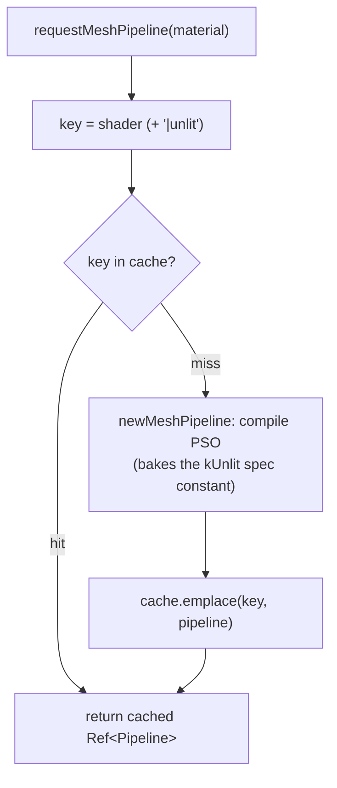

+++
title = 'Materials & PSOs'
weight = 1
+++

# Materials & PSOs

A material is a small, declarative description of how a surface draws: a shader name and a variant flag. A pipeline state object (PSO) is the compiled Vulkan object that renders with it. PSO selection is the step that maps one to the other.

The two are separated because they have different costs and different cardinalities. Many materials describe one surface each; few distinct pipelines exist. Building a PSO is expensive, so the renderer constructs each one lazily and caches it, keyed by the properties that affect the pipeline rather than by material instance. A thousand entities with a thousand base colors then resolve to one PSO, which lets the draw-list batcher group them.

## How selection works

A material names a shader and a variant. The renderer derives a cache key from those, looks it up, and returns the cached pipeline or builds one and inserts it. The client never constructs a pipeline directly; it holds a `Material` and asks the renderer for the matching `Ref<Pipeline>`, which many draws share.

## The material

```cpp
struct Material
{
    std::string shader = "shaders/mesh.spv";
    bool unlit = false;  // selects the unlit übershader permutation (a distinct PSO)
};
```

That is the whole type. The per-instance albedo texture and base color live on the `DrawItem`, not the material; the material only decides which pipeline a renderable draws with. There is one übershader (`mesh.slang`), so almost everything resolves to the same PSO and the `unlit` flag picks a second one. See [the übershader](../ubershader-and-specialization/).

## Build on miss

`requestMeshPipeline` is the entry point. It builds a cache key from the material, looks it up, and either returns the cached pipeline or builds one and inserts it. The cache is an `unordered_map<std::string, Ref<Pipeline>>` on the renderer; the key is the shader name with `|unlit` appended for the unlit variant.



Two materials that name the same shader and variant get the *same* `Ref<Pipeline>`, because the übershader makes them interchangeable. A build failure logs and returns null rather than aborting. The draw-list path skips a batch whose pipeline came back null, so one bad shader cannot bring down the frame.

## What a PSO bakes in

`newMeshPipeline` is the only place a mesh pipeline is constructed. Beyond the shader stages it bakes in everything that has to match the frame's targets:

- the MSAA sample count;
- the `rgba16f` offscreen color format and `D32` depth format for dynamic rendering;
- an `eLessOrEqual` depth compare, so a depth pre-pass's values pass;
- the full set-layout list — sets 0–5 always, 6–7 only when ray tracing is enabled.

Because the sample count is baked in, the cache rebuilds when the AA mode changes targets.

`pipelineCount` returns the live cache size, reported by `se render-stats`. It is a direct check that übershader reuse is happening, and the number should stay small.

## In the code

| What | File | Symbols |
|---|---|---|
| Material type | `renderer_types.cppm` | `Material` |
| Cache + counters | `renderer_types.cppm` | `Pipelines::cache`, `pipelineCount` |
| Lookup / build-on-miss | `renderer_pipelines.cpp` | `requestMeshPipeline` |
| PSO construction | `renderer_pipelines.cpp` | `newMeshPipeline` |

## Related

- [Übershader](../ubershader-and-specialization/) — why N materials share one PSO
- [Descriptor sets](../descriptor-sets/) — the set-layout list every mesh PSO bakes in
- [Render graph](../../frame-and-render-graph/render-graph-overview/) — where the resolved pipeline is bound
