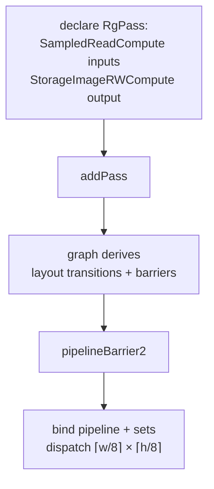

+++
title = 'Compute post-process'
weight = 8
+++

# Compute post-process

Every screen-space and post-process pass in the engine shares one skeleton: a compute shader that reads
one or more images and writes a result image, plus a render-graph declaration naming which images it
touches and how. The graph turns those declarations into barriers and layout transitions. Once you see
the shape — in the [tonemap](../tonemap-and-exposure/), GTAO, SSGI, FXAA, TAA — you've seen all of them.

## How it works

A compute post-process pass is two halves: a shader and a graph declaration.

**The shader.** One invocation per pixel, dispatched in 8×8 thread groups. It reads inputs (as samplers
or storage images), does its math, and writes to a storage image. A bounds check stops edge groups from
writing past the extent:

```hlsl
[numthreads(8, 8, 1)]
void computeMain(uint3 tid : SV_DispatchThreadID)
{
    uint width, height;
    outImage.GetDimensions(width, height);
    if (tid.x >= width || tid.y >= height) { return; }
    float2 uv = (float2(tid.xy) + 0.5) * (1.0 / float2(width, height));
    // ... read, compute, write outImage[tid.xy] ...
}
```

Inputs read at arbitrary UVs are bound as `Sampler2D` (the neighborhood reads in TAA, the G-buffer taps
in GTAO). The output — and any image read and written at the same texel — is bound as an `RWTexture2D`
with an explicit `[[vk::image_format(...)]]`.

**The declaration.** The host side names the resources and how the pass uses each, then provides the
body as a closure. The FXAA pass is the smallest complete example:

```cpp
RgPass fxaaPass;
fxaaPass.name = "fxaa";
fxaaPass.kind = RgPassKind::Compute;
fxaaPass.accesses = { RgAccess{ sceneOutput,              RgUsage::SampledReadCompute },
                      RgAccess{ renderer.graph.sceneColor, RgUsage::StorageImageRWCompute } };
fxaaPass.execute = [&renderer, extent](vk::CommandBuffer cmd)
{
    cmd.bindPipeline(vk::PipelineBindPoint::eCompute, renderer.pipelines.fxaa->pipeline);
    cmd.bindDescriptorSets(..., renderer.descriptors.fxaaSet, {});
    cmd.dispatch((extent.width + 7) / 8, (extent.height + 7) / 8, 1);
};
addPass(graph, std::move(fxaaPass));
```

The dispatch group count rounds the extent up to the 8×8 group size — the same `(n + 7) / 8` the
shader's bounds check then trims back.

### The two usages that carry the pattern

Two `RgUsage` values do almost all the work:

- **`SampledReadCompute`** — an image sampled in a compute shader. The graph transitions it to
  `ShaderReadOnlyOptimal` and orders the read after whatever last wrote it.
- **`StorageImageRWCompute`** — an image read and written in place by compute. It must be in `GENERAL`
  layout, so the graph transitions it there.

A compute post-process declares its inputs as `SampledReadCompute` and its output as
`StorageImageRWCompute`, and the graph derives every transition. The tonemap is the purest case: a
single image declared `StorageImageRWCompute`, read and written at the same texel, no second target. It
transitions the offscreen **Color → General** before the pass and **General → ShaderReadOnly** after —
neither barrier written by hand.



### Why a closure, not a fixed signature

The pass body is a `std::function<void(vk::CommandBuffer)>` capturing whatever it needs — the pipeline,
the descriptor set, push-constant data, the extent. The graph doesn't know or care what a pass does; it
reads the declared `accesses` to derive barriers, then calls the closure between them. That's the same
`submit(lambda)` seam the rest of the engine uses, narrowed to a graph pass.

## In the code

| What | File | Symbols |
|---|---|---|
| Usage vocabulary | `render_graph.cppm` | `RgUsage::StorageImageRWCompute`, `SampledReadCompute`, `usageInfo` |
| Declare + add a pass | `render_graph.cppm` | `RgPass`, `RgAccess`, `addPass` |
| The smallest example | `renderer.cppm` | the `fxaa` pass |
| The purest RMW | `tonemap.slang`, `renderer.cppm` | `computeMain`, `addTonemapPass` |

> [!NOTE]
> An image read and written in the same dispatch is bound once as `RWTexture2D` and declared once as
> `StorageImageRWCompute`. Don't import it twice or alias it as a second resource — the graph tracks one
> layout per imported handle, and a second handle for the same image would mis-track the transitions.
> The SSGI history copy reuses the single `prevColor` handle for both its read and write for this reason.

## Related

- [Tonemapping](../tonemap-and-exposure/) — the purest read-modify-write instance
- [Render graph](../../frame-and-render-graph/render-graph-overview/) — where the barriers are derived
- [Usage and barrier derivation](../../frame-and-render-graph/usage-and-barrier-derivation/) — the full hazard table
