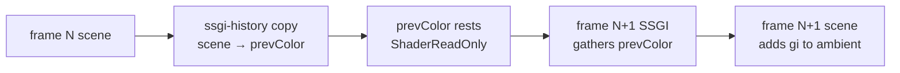

+++
title = 'SSGI'
weight = 4
math = true
+++

# SSGI

Direct light hits a red wall, bounces, and tints the white floor beside it. That second bounce is
global illumination, and a forward renderer doesn't get it for free. SSGI approximates one bounce in
screen space: each pixel fires a few short rays into the hemisphere above it, and where a ray hits
nearby geometry it gathers that surface's lit color from the previous frame as incoming indirect
radiance. The gathered radiance adds to the ambient term.

## How it works

Each pixel reconstructs its view-space position $p$ and normal $n$ from the
[thin G-buffer](../thin-gbuffer/), then builds a tangent basis $(t, b, n)$ to orient a cosine-weighted
hemisphere. It fires four rays, each a cosine sample so directions near the normal — which contribute
most to diffuse — are favored:

$$
\text{local} = \big(\sqrt{u_1}\cos\varphi,\ \sqrt{u_1}\sin\varphi,\ \sqrt{1 - u_1}\big), \qquad \varphi = 2\pi\,u_2
$$

The sample coordinates $(u_1, u_2)$ are jittered per pixel by a hash and stepped by the golden angle
across the four rays, so the small ray count covers the hemisphere without a fixed pattern.

Each ray marches in view space, projecting to the screen and reading the stored depth at every step. A
hit registers the first time the ray dips just behind the stored surface, inside a thickness window
like the [contact shadow](../contact-shadows/) march. On a hit the ray gathers `prevColor` — the
previous frame's resolved linear-HDR color:

```hlsl
float diff = surfZ - sp.z;
if (diff > 0.02 && diff < radius * 0.5)
{
    indirect += prevColor.SampleLevel(suv, 0.0).rgb;
    break;
}
```

Using last frame's image is what makes a screen-space bounce affordable: the hit surface's full
lighting (direct + ambient) is already computed and sitting in a texture. The cost is a one-frame lag
and a dependence on whatever was on screen last frame. The four rays are averaged, scaled by an
intensity knob, and stored in an `rgba16f` map.

### Where the radiance lands

The mesh fragment shader treats the gathered radiance as extra incoming light on the diffuse albedo,
added into the ambient term and modulated by AO so occluded creases don't over-bounce:

```hlsl
if (globals.screenFlags.y != 0)
{
    float  ao = globals.counts.w != 0 ? aoMap.SampleLevel(screenUv, 0.0).r : 1.0;
    float3 gi = ssgiMap.SampleLevel(screenUv, 0.0).rgb;
    ambient += gi * albedo * (1.0 - metallic) * ao;
}
```

It adds to the indirect term, never the direct lights, and only for non-metals (metals have no diffuse
response). Gated by `screenFlags.y`.

### Feeding the next frame

For SSGI to read last frame's color, last frame has to save it before the in-place tonemap turns it
display-referred. A `ssgi-history` compute pass copies the scene's resolved linear-HDR color into
`prevColor` right after the scene pass, then a barrier-only pass restores `prevColor` to its resting
`ShaderReadOnly` layout for next frame. The renderer imports the `prevColor` handle once and tracks its
layout across both the read (this frame's gather) and the write (this frame's capture).



## In the code

| What | File | Symbols |
|---|---|---|
| The gather | `ssgi.slang` | `computeMain`, cosine-hemisphere sampling, `viewPosFromUv` |
| Pass + prev-color import | `renderer.cppm` | `ssgi` pass, `prevColorResource`, `ssgi-history` copy |
| Where GI is added | `mesh.slang` | `ssgiMap`, `screenFlags.y` |

> [!NOTE]
> SSGI only sees what's on screen. A bounce off a surface that's off-screen or hidden behind nearer
> geometry simply doesn't happen, because the gather can only read pixels the previous frame stored.
> That's the defining limit of any screen-space method, and the reason the lighting roadmap moves on to
> world-space [DDGI](../../global-illumination-and-raytracing/) for off-screen bounce.

## Related

- [G-buffer](../thin-gbuffer/) — the geometry the rays march against
- [Contact shadows](../contact-shadows/) — the same view-space march, different gather
- [GTAO](../gtao/) — the AO that modulates the bounce
- [Tonemapping](../tonemap-and-exposure/) — runs after the linear color is captured for history
