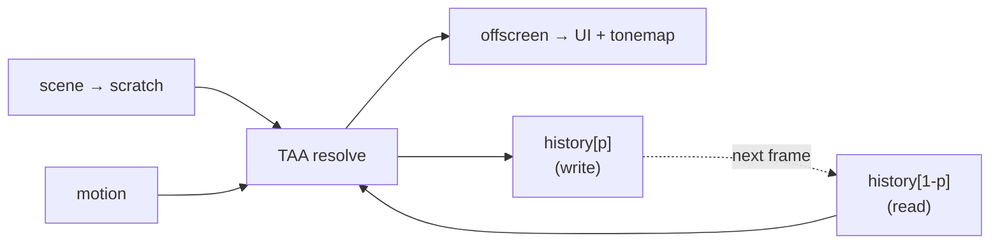

+++
title = 'TAA'
weight = 6
math = true
+++

# TAA

TAA smooths edges and noise by blending each frame with the one before it. Done naively that smears
moving content into ghost trails. The trick is reprojection plus a clamp: follow the
[motion vector](../motion-vectors/) backward to the right history pixel, then clamp that history into
the range of colors actually present around the current pixel, so a stale sample can't survive. The
resolve is one compute pass that writes both the offscreen and the next frame's history.

## How it works

The scene renders its 1x result into a scratch image (TAA and FXAA share that scratch). The resolve
pass reads the current frame, the history, and the motion buffer, and writes the blended result in
three steps.

**Reproject.** The motion vector for this pixel is added to its UV to find where the same surface sat
last frame, and the history is sampled there (`histUv = uv + mv`).

**Clamp.** A 3×3 neighborhood of the current frame gives a min/max color box, and the reprojected
history is clamped into it:

$$
\text{hist}' = \operatorname{clamp}\big(\text{hist},\ \min_{3\times 3} \text{cur},\ \max_{3\times 3} \text{cur}\big)
$$

This is the part that earns TAA its reputation as fiddly and its payoff as worth it. The motion vector
is imperfect — it tracks camera reprojection only, and disocclusion exposes surfaces with no valid
history. When the reprojected sample disagrees with everything around it, the clamp drags it back into
the plausible range, rejecting ghosting at the cost of weakening accumulation exactly where it's
unreliable.

**Blend.** The clamped history mixes with the current frame by an exponential weight:

$$
\text{result} = \operatorname{lerp}(\text{cur},\ \text{hist}',\ w)
$$

The weight is the history weight from the push constant (`TaaHistoryWeight`). It's forced to zero —
take the current frame whole — in two cases: the first frame, when there's no valid history yet
(`params.y < 0.5`), and when the reprojected UV lands off-screen (a disocclusion). Those are exactly
the cases where there's no trustworthy history to blend.

The result is written to both the offscreen (what the UI and tonemap read) and the next frame's
history. The blend feeds itself: this frame's resolved color becomes next frame's history, so each
frame's contribution decays geometrically.

### History ping-pong

There are two history images. The resolve reads one and writes the other, flipping parity each frame:

The renderer tracks `historyIndex` and `historyValid`, flipping the index and marking history valid
after each resolve. Reading and writing distinct images keeps it well-defined; a single in-place
history would be a read-write hazard on its own data.

## In the code

| What | File | Symbols |
|---|---|---|
| Reproject + clamp + blend | `taa.slang` | `computeMain`, the 3×3 min/max, `histUv`, `lerp` |
| Validity gate | `taa.slang` | `params.y`, the off-screen `histUv` check |
| Pass + ping-pong | `renderer.cppm` | `taa` pass, `historyIndex`, `historyValid`, `TaaHistoryWeight` |

> [!NOTE]
> The resolve reads and writes linear HDR, not display color. It runs before the
> [tonemap](../tonemap-and-exposure/), so the history accumulates in the same linear space the scene was
> rendered in. Blending tonemapped values would accumulate in the wrong color space and shift as
> exposure changes.

## Related

- [Motion vectors](../motion-vectors/) — the reprojection velocity TAA follows
- [Tonemapping](../tonemap-and-exposure/) — the next step, after the resolve
- [Compute post-process](../compute-post-process-pattern/) — the dispatch + RMW shape it shares
