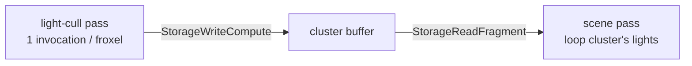

+++
title = 'Light culling'
weight = 6
math = true
+++

# Light culling

A light only affects pixels near it, so looping every punctual light for every fragment wastes work. Clustered culling splits the view frustum into a 3D grid of cells (froxels) and, in a compute pass, builds a per-cell list of the lights that touch it. The mesh fragment then loops only its cell's lights. This is the engine's first compute pipeline and the heart of its Forward+ lighting.

## The froxel grid

The grid is 16×9×24 — 3456 clusters. X and Y tile the screen; Z slices view-space depth. The Z slices are exponential, not linear:

$$
z_n = -\text{near}\,\left(\frac{\text{far}}{\text{near}}\right)^{n / N_z}
$$

Exponential spacing puts thin slices near the camera and fat ones far away, matching how perspective compresses depth — so each froxel covers roughly constant screen-and-depth volume, and lights cluster sensibly at all distances. The fragment inverts the same formula in `clusterIndexFor` to find a pixel's slice; [froxel bounds](../froxel-bounds/) covers how each cell's view-space box is built.

## The cull dispatch

`light_cull.slang`'s `computeMain` runs one invocation per cluster, in groups of 64. The test is sphere-vs-AABB: a light is a sphere (position + range), the cluster is a view-space box. The closest point in the box to the sphere center is found by `clamp`, and the light intersects if that point is within the radius — the standard squared-distance test, no square root:

```hlsl
float3 closest = clamp(posView, aabbMin, aabbMax);
float3 delta = posView - closest;
if (dot(delta, delta) <= radius * radius) { /* append index */ }
```

The renderer dispatches `(ClusterCount + 63) / 64` groups as a Compute-kind graph pass that writes the cluster buffer (`StorageWriteCompute`); the scene fragment reads it. The [render graph](../../frame-and-render-graph/render-graph-overview/) derives the compute→fragment barrier from those declared usages.



## Reading it in the fragment

The mesh fragment finds its cluster from pixel position and view-space Z, then loops only that cluster's lights. The same `punctual` BRDF runs whether the loop comes from a cluster or from the brute-force fallback (`clusterParams.screenSize.z == 0`), so the clustered and reference paths are pixel-identical — the cull only changes which lights are visited, never how they shade.

## Design and trade-offs

Building the cluster AABBs every frame in the compute pass (rather than caching them) keeps the code trivial and correct under any camera; the grid is small enough that it's cheap. Two hard limits are fixed-size: each cluster holds at most `MaxLightsPerCluster` = 64 lights, and excess past that is dropped silently. The grid is single-resolution with no hierarchy. These are deliberate caps for the engine's scene scale, with the cluster buffer and dispatch left as the seam for a larger grid or tighter cull. The grid dimensions and cap are duplicated across `renderer_detail.cppm`, `light_cull.slang`, and `mesh.slang`, so they must change together.

## In the code

| What | File | Symbols |
|---|---|---|
| The cull kernel | `light_cull.slang` | `computeMain` |
| Exponential Z slices | `light_cull.slang` | `tileNear` / `tileFar` |
| Grid dims + cap | `renderer_detail.cppm` | `ClusterGridX/Y/Z`, `ClusterCount`, `MaxLightsPerCluster` |
| Dispatch + buffer usage | `renderer.cppm` | `beginFrameGraph` (`doCull`), `cull.dispatch` |
| Cluster-params upload | `renderer_lighting.cpp` | `ClusterParams` |
| Fragment lookup + loop | `mesh.slang` | `clusterIndexFor`, `fragmentMain` (clustered branch) |

## Related

- [Froxel bounds](../froxel-bounds/) — how each cluster's view-space AABB is built
- [Clustered forward](../../lighting-and-brdf/clustered-forward/) — the lighting model this feeds
- [Punctual lights and attenuation](../../lighting-and-brdf/punctual-lights-and-attenuation/) — what `punctual` evaluates
- [Render graph](../../frame-and-render-graph/render-graph-overview/) — where the compute pass slots in
