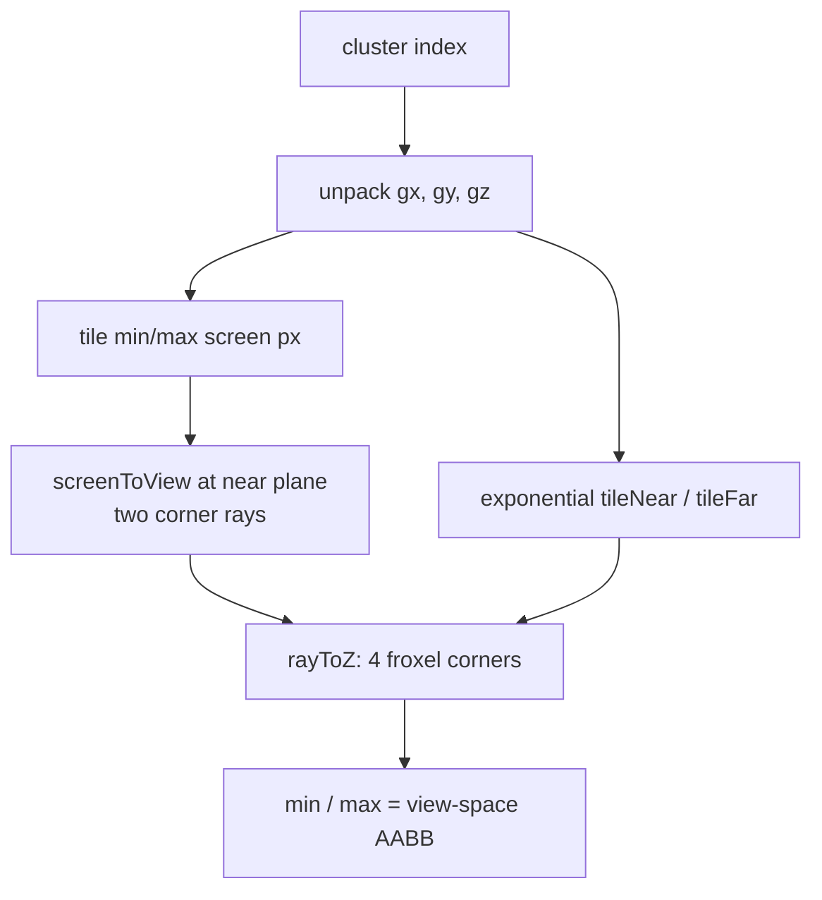

+++
title = 'Froxel bounds'
weight = 7
math = true
+++

# Froxel bounds

Before the cull test can ask "does this light touch this froxel?", each froxel needs a view-space bounding box. The cull shader builds that box on the fly from the froxel's screen tile and its two exponential-Z planes — the geometry behind the [light culling](../clustered-light-culling/) sphere test.

## From cluster index to screen tile

The flat cluster index unpacks into 3D grid coordinates with the encoding `index = x + y·gridX + z·gridX·gridY`. The X/Y pair gives a screen tile. Tiles split the screen evenly, so the tile's min and max screen-pixel corners are just the grid coordinate times the tile size:

```hlsl
float2 tileSize = float2(params.screenSize.xy) / float2(params.gridSize.xy);
float2 minSS = float2(float(gx),     float(gy))     * tileSize;
float2 maxSS = float2(float(gx + 1), float(gy + 1)) * tileSize;
```

## Screen pixels to view-space rays

`screenToView` maps a pixel to NDC, multiplies by `inverseProjection`, and does the perspective divide. Both tile corners are unprojected at the near plane (`ndcZ = 0`), giving two view-space points on the camera's near plane. With the eye at the view-space origin, the line from the origin through each point is the frustum edge ray for that screen corner.

## Slicing the rays at the Z planes

The cluster's depth extent comes from the exponential Z formula ([light culling](../clustered-light-culling/) covers why). Each near-plane corner ray is intersected with the two planes $z = z_\text{near}$ and $z = z_\text{far}$. `rayToZ` scales the point so its $z$ lands on the target plane — for an eye-origin ray through $P$, the point at depth $z_d$ is $P \cdot (z_d / P_z)$:

```hlsl
float3 rayToZ(float3 p, float zDist) { return p * (zDist / p.z); }
```

Two corner rays × two Z planes gives four view-space points (the near-quad and far-quad corners). The box is the component-wise min and max of those four.



## Design and trade-offs

The box is a loose fit. A froxel is really a truncated pyramid (the near quad is smaller than the far quad), and the axis-aligned box that encloses all four corners is slightly larger than the true volume. That over-estimate means a light might be added to a froxel it doesn't strictly overlap, so the cull can keep a few extra lights — never miss one. For a visibility cull, conservative-but-loose is the right bias: a missed light is a visible artifact, an extra light is a little wasted shading. Testing the actual froxel planes would trade more compute for shorter light lists; the AABB is the cheap, correct-by-over-inclusion choice.

## In the code

| What | File | Symbols |
|---|---|---|
| Unpack index → grid coords | `light_cull.slang` | `computeMain` (`gx`/`gy`/`gz`) |
| Screen tile corners | `light_cull.slang` | `computeMain` (`tileSize`, `minSS`/`maxSS`) |
| Unproject to view space | `light_cull.slang` | `screenToView` |
| Slice rays at Z planes | `light_cull.slang` | `rayToZ`, `tileNear`/`tileFar` |
| The view-space AABB | `light_cull.slang` | `aabbMin`/`aabbMax` |
| view + inverseProjection inputs | `renderer_lighting.cpp` | `ClusterParams` |

## Related

- [Light culling](../clustered-light-culling/) — the sphere-vs-AABB test these bounds feed
- [Clustered forward](../../lighting-and-brdf/clustered-forward/) — the lighting model behind it
