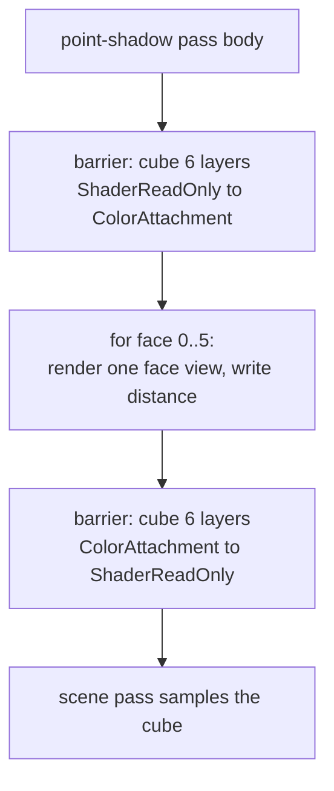

+++
title = 'Point shadows'
weight = 3
math = true
+++

# Point shadows

A point light shines in every direction, so a single 2D depth map can't cover it. Instead one point light casts an omnidirectional shadow: the scene's world-space distance to the light is rendered into the six faces of a cubemap, and the mesh fragment samples that cube by the light-to-fragment direction. Distance, not depth — that's the key difference from the 2D maps.

> [!NOTE]
> Only one point light is shadowed. Six scene re-draws per shadowed point light keep it that way for now.

## Why distance, not depth

The 2D maps store clip-space depth, which only makes sense relative to one projection. A point light has six projections, and a fragment doesn't know which face it landed on until it picks a sample direction. Storing linear world distance sidesteps that: whatever face the light-to-fragment ray hits, the value there is the distance to the nearest occluder along that ray, directly comparable to the fragment's own distance to the light. The shadow-pass fragment is just `length(worldPos - lightPos)`. The cube is an `R32Sfloat` color image, 512 per face, with six color attachment views plus one cube view for sampling.

## Rendering the six faces

`pointShadowFaceMatrices` builds six world-to-clip matrices, one per face, with a 90° vertical FOV and aspect 1 — exactly enough to tile the full sphere with no gaps or overlap. The projection's Y is flipped so the rendered faces round-trip with a `TextureCube` sampled by world direction. Each face clears its color to `farPlane * 2`, so any texel no triangle covers reads as "no occluder."

The cube can't be a single graph attachment, because its six array layers exceed the graph's single-layer image barrier. So the point-shadow pass is declared as a Compute-kind pass — the graph opens no rendering scope — and its body (`recordPointShadow`) opens six per-face dynamic-rendering scopes and manages the cube's layout transitions by hand.



## Sampling and comparing

In the mesh fragment, `pointShadow` reconstructs the fragment's distance to the light, samples the cube along the light-to-fragment direction, and compares:

```hlsl
float dist = length(worldPos - globals.pointShadow.xyz);
float stored = pointShadowMap.SampleLevel(normalize(toFrag), 0.0).r;
return dist - bias <= stored ? 1.0 : 0.0;
```

If the fragment is at most `stored + bias` away, nothing nearer blocked the light along that ray, so it's lit. The constant `bias` matches `PointShadowDistanceBias` and is in world units, not depth units — see [shadow bias](../shadow-bias/). Like the spot, this applies only to the one shadowed point light, gated by `pointShadowMeta.x` (its index) and `.y` (enabled).

## Design and trade-offs

A distance cube is direction-agnostic, which is why it fits point lights naturally. The comparison is a hard test (`<=`) rather than filtered, so point shadows have crisper, slightly aliased edges than the PCF-filtered 2D maps; a PCF cube or variance shadows would soften them later. The bias is a single world-space constant, which can under- or over-bias depending on the light's range, but it's stable for the modest scenes the engine targets.

## In the code

| What | File | Symbols |
|---|---|---|
| Write distance per face | `point_shadow.slang` | `fragmentMain` |
| Six face matrices | `renderer_detail.cppm` | `pointShadowFaceMatrices` |
| Cube + face views | `renderer_detail.cppm` | `newColorCubeImage`, `PointShadowSize` |
| Render the six faces | `renderer_drawlist.cpp` | `recordPointShadow` |
| Add the Compute-kind pass | `renderer.cppm` | `beginFrameGraph` (`doPointShadow`) |
| Sample + compare distance | `mesh.slang` | `pointShadow`, `PointShadowDistanceBias` |

## Related

- [Shadow bias](../shadow-bias/) — the world-space distance bias used here
- [Directional shadows](../directional-shadows/) — the 2D depth-map alternative
- [Render graph](../../frame-and-render-graph/render-graph-overview/) — why this is a Compute-kind pass
