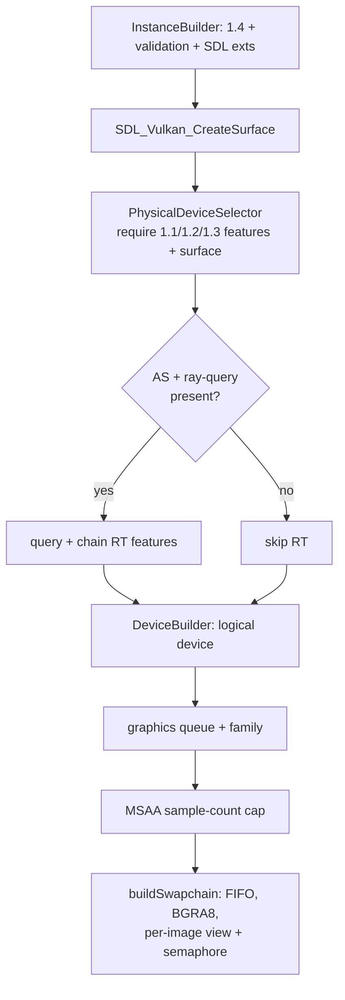

+++
title = 'Device & swapchain'
weight = 2
+++

# Device & swapchain

Bringing up Vulkan is the sequence of selecting an instance, a physical device, a logical device with
the features the renderer needs, a queue, and a swapchain over the window surface. These objects are
the foundation every later GPU operation builds on, and each step can fail for reasons outside the
program's control — no GPU, a missing feature, a surface the platform refuses.

The engine drives the whole sequence through vk-bootstrap, which collapses the boilerplate into a few
builders. `newRenderer` runs the bring-up top to bottom and returns a `Result<Renderer>`, so any
failure surfaces as a readable message rather than a crash.

## Instance and surface

`vkb::InstanceBuilder` sets the app and engine names, requires API version 1.4, turns on validation
layers, and installs the engine's debug callback, which prints messenger output as one
`[saffron:vulkan] …` line and filters known noise — see [Logging](../../core-and-conventions/logging/).
SDL3 supplies the platform surface extensions via
`SDL_Vulkan_GetInstanceExtensions`. The window surface comes from SDL directly: `SDL_Vulkan_CreateSurface`
produces a raw `VkSurfaceKHR`, wrapped as `vk::SurfaceKHR`.

## Feature negotiation

A bare 1.4 device is not enough. The renderer requires specific feature bits across three feature
structs, declared before selection and required during it:

- **1.3:** `dynamicRendering` and `synchronization2` — the two pillars the renderer is built on (see
  [dynamic rendering](../dynamic-rendering/) and [barriers](../synchronization2-and-barriers/)). No
  render-pass objects, no legacy barriers.
- **1.2:** descriptor-indexing bits for [bindless textures](../../materials-and-pipelines/bindless-textures/)
  (`runtimeDescriptorArray`, `descriptorBindingPartiallyBound`, `descriptorBindingSampledImageUpdateAfterBind`,
  `shaderSampledImageArrayNonUniformIndexing`) plus `bufferDeviceAddress` (needed by KHR acceleration
  structures).
- **1.1:** `shaderDrawParameters`, because Slang's `SV_VertexID` emits the DrawParameters capability.

`vkb::PhysicalDeviceSelector` requires all three sets and the surface, then calls `select()`. The
descriptor-indexing bits are hard requirements: a device without bindless support is rejected up front
with a clear message rather than crashing later.

## Optional ray tracing

Ray tracing is opt-in per device and never a hard requirement. The selector calls
`enable_extension_if_present` for `VK_KHR_acceleration_structure`, `VK_KHR_ray_query`, and
`VK_KHR_deferred_host_operations`, which do not fail when absent. Only when both the acceleration-structure
and ray-query extensions are present does the code query their feature bits and chain the RT structs into
device creation. `context.rtSupported` records the outcome.

The KHR acceleration-structure and ray-query entry points are not statically exported by the loader. When
RT is on they resolve through `vkGetDeviceProcAddr` into an `RtDispatch` table; if any fails to resolve, RT
is disabled with a warning. On the software Vulkan driver in the build toolbox this path is unused.

## Device, queue, sample-count cap

`vkb::DeviceBuilder` builds the logical device. A single graphics queue is fetched along with its family
index — the engine is single-queue. The MSAA capability is read once here: the intersection of
`framebufferColorSampleCounts` and `framebufferDepthSampleCounts`, capped at 8×, becomes
`targets.maxSampleCount`, which [MSAA](../../anti-aliasing/msaa/) clamps user requests against.

## Swapchain

`buildSwapchain` wraps `vkb::SwapchainBuilder`. It requests a `B8G8R8A8_UNORM` / sRGB-nonlinear surface
format and `FIFO` present mode (v-sync, always supported), sized to the window. Each swapchain image gets
a 2D view and a `renderFinished` semaphore — one per image, not per frame (see
[frame sync](../frame-sync-and-resize/)).

`TRANSFER_SRC` on swapchain images is only spec-guaranteed for `COLOR_ATTACHMENT`, so the builder checks
`getSurfaceCapabilitiesKHR` first and requests it only when allowed. A surface that disallows it disables
window screenshots (`captureSupported = false`) instead of failing the build. On rebuild, the old
swapchain is passed as `set_old_swapchain` so the driver can recycle it.

## Keeping the vk-bootstrap objects

`VulkanContext` holds both the `vkb::Instance` / `vkb::Device` and the plain `vk::` handles taken from
them. vk-bootstrap's destroy helpers need those `vkb::` objects, so `destroyRenderer` keeps them to tear
down in exact reverse order: allocator, then surface, device, instance.

## In the code

| What | File | Symbols |
|---|---|---|
| Whole bring-up | `renderer.cppm` | `newRenderer` |
| Feature structs | `renderer.cppm` | `features11`, `features12`, `features13` |
| Optional RT detection | `renderer.cppm` | `enable_extension_if_present`, `rtSupported`, `RtDispatch` |
| Swapchain build | `renderer_detail.cppm` | `buildSwapchain`, `captureSupported` |
| Context + teardown | `renderer_types.cppm`, `renderer.cppm` | `VulkanContext`, `destroyRenderer` |

## Related

- [No-exceptions Vulkan-Hpp](../vulkan-hpp-no-exceptions/) — the `Result`-returning style every step uses
- [Frame sync](../frame-sync-and-resize/) — the per-image semaphores + swapchain rebuild
- [Dynamic rendering](../dynamic-rendering/) — the 1.3 feature that removes render passes
- [VMA allocator](../vma-allocator/) — created right after the device
