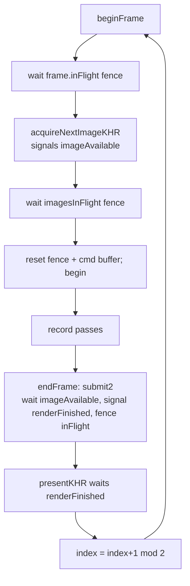

+++
title = 'Frame sync'
weight = 6
+++

# Frame sync

The renderer keeps two frames in flight: while the GPU works on one, the CPU records the next. That needs synchronization so the CPU never overwrites a command buffer the GPU is still reading, and so a swapchain image isn't reused before its previous present finished. The engine handles it with a per-frame ring of sync objects plus a per-image fence, and treats window/viewport resize as ordinary swapchain and target recreation.

`MaxFramesInFlight` is 2. The renderer holds an `std::array<FrameData, 2>` and a rotating `index`. Each `FrameData` is the CPU-side recording context for one in-flight frame:

```cpp
struct FrameData
{
    vk::CommandPool commandPool;
    vk::CommandBuffer commandBuffer;
    vk::Semaphore imageAvailable;
    vk::Fence inFlight;
};
```

The `imageAvailable` semaphore and `inFlight` fence belong to the *frame slot*. The `renderFinished` semaphores belong to the *swapchain image* — one per image, not per frame — because present waits on "this image's rendering is done," and an image can be presented across different frame slots.

## Acquiring a frame

`beginFrame` runs the CPU-side waits and image acquisition:

1. **Wait on the frame fence.** `waitForFences(frame.inFlight, ...)` blocks until the GPU finished the work this slot submitted two frames ago, so its command buffer is free to reset and re-record.
2. **Acquire the next swapchain image**, signaling `frame.imageAvailable`. `eErrorOutOfDateKHR` rebuilds the swapchain and skips the frame; `eSuboptimalKHR` is accepted and rendered.
3. **Wait on the image's own fence if it's still in flight.** `imagesInFlight` records which frame fence last used each image. Because the swapchain image count needn't equal `MaxFramesInFlight`, the acquired image might still be referenced by an earlier frame; waiting on its fence before reusing its `renderFinished` semaphore avoids signaling a semaphore that's still pending.
4. **Reset the fence and command buffer**, clear the frame's draw list and submission vectors, and `begin()` with `eOneTimeSubmit`.

## Submitting and presenting

`endFrame` records the UI pass, runs the graph, ends the command buffer, and submits with `submit2`. The submit uses a binary-semaphore handshake: **wait** on `frame.imageAvailable` at `eColorAttachmentOutput` (don't write color until the image is acquired), **signal** the image's `renderFinished` at `eAllCommands`, and **fence** `frame.inFlight` so this slot can wait next time around.

`presentKHR` waits on `renderFinished` and queues the image. An out-of-date or suboptimal present triggers `recreateSwapchain`. The slot then advances `index = (index + 1) % MaxFramesInFlight`.



## Resize

Two resizes happen, both in `beginFrame`, both gated on a device idle. A full `device.waitIdle()` is the simple, correct choice: the offscreen is a single shared target, nothing may still be reading it, and resizes are rare (a dragged panel edge), so the stall doesn't matter.

**Swapchain resize.** When the window extent differs from the swapchain extent, `beginFrame` idles the device, calls `recreateSwapchain`, and returns `false` to skip the frame. `recreateSwapchain` bails on a zero extent (minimized) and otherwise rebuilds, passing the old swapchain as `set_old_swapchain` so the driver can recycle it. Per-image views and `renderFinished` semaphores are recreated to match.

**Viewport resize.** The editor's Viewport panel can differ in size from the window and drives `desiredWidth/Height`. When those differ from the offscreen extent, `beginFrame` idles and recreates the offscreen color, depth, and every dependent target — MSAA, FXAA/TAA scratch, the SSAO G-buffer and AO maps, TAA motion + history, and (when supported) ReSTIR reservoirs — then bumps a `generation` counter so the UI knows the [viewport descriptor](../../frame-and-render-graph/cross-frame-layouts/) must refresh.

## Why a per-image fence on top of per-frame fences

The per-frame fence alone guarantees the *slot's* command buffer is safe to reuse. It does not guarantee the *image* is free — with, say, 3 swapchain images and 2 frames in flight, the image you just acquired might have last been used by the other slot. Reusing its `renderFinished` semaphore before that work finished is a validation error. The `imagesInFlight` array closes the gap by tracking the last frame fence per image and waiting on it.

## In the code

| What | File | Symbols |
|---|---|---|
| Frames-in-flight constant | `renderer_types.cppm` | `MaxFramesInFlight` |
| Per-frame sync objects | `renderer_types.cppm` | `FrameData`, `FrameSync` |
| Per-image fences/semaphores | `renderer_types.cppm` | `Swapchain::imagesInFlight`, `renderFinished` |
| Acquire + waits | `renderer.cppm` | `beginFrame` |
| Submit + present + advance | `renderer.cppm` | `endFrame`, `submit2`, `presentKHR` |
| Swapchain rebuild | `renderer_detail.cppm` | `recreateSwapchain`, `buildSwapchain` |

> [!NOTE]
> `acquireNextImageKHR` and `presentKHR` returning `eSuboptimalKHR` or `eErrorOutOfDateKHR` are not errors — they mean "rebuild the swapchain." Both sites branch on the result directly instead of going through `checked()`, which would turn any non-`eSuccess` into an `Err`.

## Related

- [Device & swapchain](../device-and-swapchain/) — how the swapchain + its semaphores are built
- [Cross-frame layouts](../../frame-and-render-graph/cross-frame-layouts/) — the offscreen layout + generation counter carried across frames
- [No-exceptions Vulkan-Hpp](../vulkan-hpp-no-exceptions/) — why acquire/present skip `checked`
- [Render graph overview](../../frame-and-render-graph/render-graph-overview/) — recorded between begin and endFrame
