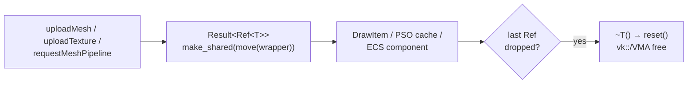

+++
title = 'Meta-layer resources'
weight = 7
+++

# Meta-layer resources

With Vulkan-Hpp's smart handles turned off, something has to own GPU resources and free them. The engine uses a small set of move-only RAII wrappers — `Pipeline`, `Image`, `Buffer`, `GpuMesh`, `GpuTexture`, plus `Image3D` and `AccelerationStructure` — each owning its raw `vk::` / VMA handles and freeing them in its destructor. They're passed around as `Ref<T>` (a `std::shared_ptr`), so a logical resource is a reference-counted object, not an opaque integer behind a manager.

## The wrapper shape

Every wrapper follows the same shape, e.g. `Pipeline`:

```cpp
struct Pipeline
{
    vk::Device device;  // borrowed
    vk::Pipeline pipeline;
    vk::PipelineLayout layout;

    Pipeline(Pipeline&&) noexcept;             // steal, null out other
    auto operator=(Pipeline&&) noexcept -> Pipeline&;  // reset() then steal
    ~Pipeline() { reset(); }
    void reset();  // null-check every handle, destroy, null out
};
```

Three invariants hold for all of them:

- **Move-only.** Copy is deleted; move steals the handles and nulls the source so the destructor can't double-free. No shared ownership of the raw handle.
- **`reset()` is the single free path.** Destructor, move-assignment, and explicit `reset()` all funnel through it. It null-checks every handle and the owning device/allocator, so a default or moved-from wrapper destroys to nothing.
- **Borrowed device/allocator.** The wrapper holds a `vk::Device` and/or `VmaAllocator` it does *not* own — only to free its handles. That's why teardown order matters.

`Image`/`GpuTexture`/`Image3D` free a view and an image; `Buffer`/`GpuMesh` free buffers; `AccelerationStructure` frees the AS handle through a borrowed function pointer, then its backing buffer.

## Ref = shared_ptr

The wrappers are move-only, but logical resources are shared between the scene draw list, the PSO cache, ECS components, and capture closures. One alias in `Saffron.Core` bridges that:

```cpp
template <typename T>
using Ref = std::shared_ptr<T>;
```

Factories return `Result<Ref<T>>` and `make_shared` the moved wrapper — `uploadMesh` returns `Ref<GpuMesh>`, `uploadTexture` returns `Ref<GpuTexture>`, `requestMeshPipeline` returns `Ref<Pipeline>`. The shared_ptr owns the one move-only wrapper; when the last `Ref` drops, the destructor runs and frees the GPU resource. So the meta-layer is a move-only RAII wrapper for correctness, wrapped in a `shared_ptr` for sharing. No base class, no virtual dtor, no handle table.

It's a thin layer that sits between the raw Vulkan handles and the rest of the engine — thin enough that there's no abstraction tax, present enough that nobody outside the renderer touches a raw handle. It keeps the *shape* of the old engine's resource objects (you pass a `Ref<GpuMesh>` around like an object) while dropping the OOP machinery: plain structs with a destructor, not subclasses of a `Resource` base.



## The teardown contract

Every wrapper borrows the device and allocator, so nothing may be alive when those are destroyed. The contract has two halves:

1. **`waitGpuIdle` before releasing Refs.** No in-flight command buffer may still reference a resource when its destructor runs. The run loop calls `waitGpuIdle` before the client's `onExit`, and `destroyRenderer` idles again first thing.
2. **Drop every `Ref` before the allocator/device.** `destroyRenderer` explicitly resets the renderer's own Refs and the closure vectors that might capture them — scene draw list, PSO cache, submission vectors, default white texture, every pipeline and target — then destroys descriptor pools, the allocator, and the device, in that order.

Get the order wrong and a wrapper's destructor calls `vmaDestroyImage` on an already-destroyed allocator. The explicit reset sequence in `destroyRenderer` guarantees it doesn't.

## In the code

| What | File | Symbols |
|---|---|---|
| The wrappers | `renderer_types.cppm` | `Pipeline`, `Image`, `Buffer`, `GpuMesh`, `GpuTexture`, `Image3D`, `AccelerationStructure` |
| Move-only + `reset()` | `renderer_types.cppm` | each wrapper's move ctor / `reset` |
| The `Ref` alias | `core.cppm` | `Ref` |
| Factories returning `Ref` | `renderer.cppm`, `renderer_detail.cppm` | `uploadMesh`, `uploadTexture`, `requestMeshPipeline`, `makeRtBuffer` |
| Teardown order | `renderer.cppm` | `destroyRenderer`, `waitGpuIdle` |

> [!NOTE]
> A `GpuTexture` destructor does *not* reclaim its bindless slot. No live material references a destroyed texture's slot, so its stale descriptor is never sampled. Slots leak across the session, but the array holds 1024, and a real reclaim would need to defer past in-flight frames — not worth it for v1.

## Related

- [No-exceptions Vulkan-Hpp](../vulkan-hpp-no-exceptions/) — why smart handles are off and the engine owns handles itself
- [VMA allocator](../vma-allocator/) — the borrowed allocator these wrappers free through
- [GPU mesh upload](../../geometry-and-assets/gpu-mesh-upload/) — `uploadMesh` building a `GpuMesh` and returning a `Ref`
- [Material and PSO selection](../../materials-and-pipelines/material-and-pso-selection/) — the `Ref<Pipeline>` cache
